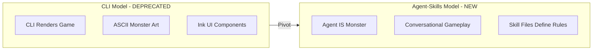

# Agent-Skills Documentation Pivot

This plan transforms all OnboardMe documentation from CLI-centric to agent-skills-centric, where the game runs entirely within coding agent platforms (Cursor, Claude Code) through skill files.

## Core Concept Change



The fundamental shift: **The agent doesn't facilitate the game — the agent IS the game.**

---

## Phase 0: Foundation

### 0.1 Create NEW [context/agent/SKILL-CONTRACT.md](context/agent/SKILL-CONTRACT.md)

Every game skill MUST follow this template structure:

```markdown
## Skill Contract Template

### Goal

What skill this game teaches/tests

### Inputs

- Files the agent may read
- Commands the agent may run
- Files the agent may edit (if any)

### State Keys

- What it reads from state.json
- What it writes to state.json

### Rubric (MANDATORY)

| Tier      | Criteria                          | Example                                                |
| --------- | --------------------------------- | ------------------------------------------------------ |
| Incorrect | Answer shows misunderstanding     | "It's a Python project" (when it's Node)               |
| Partial   | Right direction, missing details  | "It's a Node API" (missing framework)                  |
| Correct   | Accurate and complete             | "It's an Express API with PostgreSQL"                  |
| Deep      | Shows insight beyond the question | "Express API with PostgreSQL, uses repository pattern" |

### Recovery

- What to do if user is stuck (progressive hints)
- What to do if user disputes scoring
- How to get back on track if conversation derails

### Timeboxing

- Expected duration: X minutes
- When to move on even if incomplete
- Checkpoint triggers
```

### 0.2 Create NEW [context/agent/STATE-SCHEMA.md](context/agent/STATE-SCHEMA.md)

State schema with versioning and monster emotional state:

```typescript
interface OnboardMeState {
  schemaVersion: number;

  repo: {
    id: string;
    path: string;
    name: string;
  };

  player: {
    name: string;
    totalCommits: number;
    currentLives: number;
    startedAt: string;
  };

  progress: {
    currentChapter:
      | "investigation"
      | "hands-on"
      | "deep-dive"
      | "hunt"
      | "boss";
    currentGame: string;
    chaptersCompleted: string[];
    questionHistory: QuestionResult[];
  };

  monster: {
    currentMood:
      | "dismissive"
      | "annoyed"
      | "worried"
      | "desperate"
      | "peaceful";
    respectLevel: number;
    memorableExchanges: string[];
    lastMockery: string;
  };

  session: {
    conversationSummary: string;
    lastEmotionalBeat: string;
    pendingCallbacks: string[];
  };

  behavior: {
    hintUsageCount: number;
    averageResponseTime: number;
    accuracyByTopic: Record<string, number>;
    playerStyle: "methodical" | "aggressive" | "balanced" | "struggling";
  };

  context: {
    prepared: boolean;
    preparedAt: string;
    contextFiles: string[];
  };

  preferences: {
    monsterTone: "friendly" | "balanced" | "spicy" | "full-monster";
  };
}
```

---

## Phase 1: Core Design Documents

### 1.1 Rewrite [PRD.md](PRD.md)

**Current**: CLI tool with Ink UI, pre-built games, visual rendering
**New**: Agent skills framework, conversational games, dynamic experience

Key changes:

- Remove all CLI/terminal UI references
- Reframe "User Journey" around `/prepare-game` and `/play-game` commands
- Update game design for conversational model
- New success criteria focused on skill file quality
- Remove tech stack section (no runtime needed)

### 1.2 Rewrite [context/ARCHITECTURE.md](context/ARCHITECTURE.md)

**Current**: Skill-based context gathering + CLI game execution
**New**: Pure skill-based architecture

New structure:

```
.onboardme/
├── ONBOARD.md              # Main orchestrator skill
├── state.json              # Progress, scores, current game
├── games/
│   ├── FILE-DETECTIVE.md   # Game skill with rules
│   └── file-detective-context.json
└── scripts/
    └── state-manager.ts    # State read/write utilities
```

### 1.3 Create NEW [context/agent/AGENT-AS-MONSTER.md](context/agent/AGENT-AS-MONSTER.md)

This is the **most critical new document**. It defines how the agent embodies the Monster character.

Contents:

- **Character Embodiment**: Agent personality instructions
- **Voice Patterns**: How to write dialogue (adapted from MONSTER-VOICE.md)
- **Emotional Arc**: How Monster's attitude evolves across sessions
- **Behavioral Awareness**: How agent reacts to player patterns
- **Dialogue Examples Library**: Curated examples showing the humor and tone

**Example Dialogue Scenarios to Include:**

**1. Dismissive (early game):**

```
*kzzzt*
"You read the docs. Figured out it's a Node project."
*heh*
"Groundbreaking."
*slrrrrp*
"Even the interns get that far."
*[DISCONNECTED]*
```

**2. Impressed but hiding it:**

```
*kzzzzzt*
*long pause*
"...No bugs? No Stack Overflow?"
*static spike*
"Are you sure you didn't just read the source code of my questions?"
*[IMPRESSED — BUT DON'T TELL ANYONE]*
```

**3. Self-deprecating humor:**

```
*crackle*
"I'm literally made of copy-pasted code."
*heh*
"The lies we tell ourselves."
*tangle tangle*
"The lies I tell YOU."
*[CARRIER LOST]*
```

**4. Victory ending (peaceful):**

```
*the static... softens*
*gentle hum*
"You... actually understand me."
*pause*
"Not just the surface. The WHY. The history."
*the tangled threads begin to unravel*
"I'm not defeated. I'm... documented."
*[DOCUMENTED]*
```

**Signature catchphrases:**

- "I'm not deprecated. I'm CLASSIC."
- "I AM this codebase."
- "Every bug was a feature once."
- "git reset --hard PLEASE"

### 1.4 Create NEW [context/agent/CONVERSATIONAL-GAMEPLAY.md](context/agent/CONVERSATIONAL-GAMEPLAY.md)

Defines how games work as conversations:

- **Multi-turn Investigation**: How follow-up questions work
- **Answer Validation**: Semantic understanding vs agent judgment
- **Partial Credit Mechanics**: When to probe vs accept
- **Visible Loop**: Challenge → Move → Evaluation → Reward → Next
- **Off-Script Recovery**: "That's useful. Parking it. Back to the challenge: ..."

### 1.5 Create NEW [context/agent/EDITOR-AS-UI.md](context/agent/EDITOR-AS-UI.md)

Don't just chat — use FILES as the game board:

| Game           | File Created      | Purpose                                   |
| -------------- | ----------------- | ----------------------------------------- |
| File Detective | `CASE_FILE.md`    | User pastes evidence, agent stamps SOLVED |
| Flow Trace     | `FLOW_MAP.md`     | Mermaid diagram built collaboratively     |
| Code Review    | `REVIEW_NOTES.md` | User adds comments, agent responds        |
| Boss Battle    | `BOSS_BATTLE.md`  | Task list, progress, Monster state        |

**Active Tools, Not Just Talk:**

- BAD: Agent asks "What is the result of running npm test?"
- GOOD: Agent RUNS `npm test`, sees output, reacts

**Artifact Generation:** Every game MUST produce a tangible artifact.

### 1.6 Create NEW [context/agent/DYNAMIC-EXPERIENCE.md](context/agent/DYNAMIC-EXPERIENCE.md)

Adaptive gameplay design:

- **Difficulty Adjustment**: Based on answer quality
- **Question Selection**: From prepared bank vs dynamic generation
- **Personalized Hints**: Based on demonstrated knowledge
- **Snark Slider**: friendly → balanced → spicy → full-monster

---

## Phase 2: Update Narrative Documents

### 2.1 Transform [context/narrative/MONSTER-VOICE.md](context/narrative/MONSTER-VOICE.md)

Keep: Sound vocabulary, emotional states, catchphrases
Remove: CLI-specific formatting, visual specs
Add: Persona Lock Mechanism (never break character)

### 2.2 Update Remaining Narrative Docs

- [GAME-NARRATIVE.md](context/narrative/GAME-NARRATIVE.md) — Adapt for conversational model
- [COLD-OPEN.md](context/narrative/COLD-OPEN.md) — Becomes agent's opening monologue
- [PACING-GUIDE.md](context/narrative/PACING-GUIDE.md) — Conversational rhythm

---

## Phase 3: Update Technical Documents

### 3.1 Rewrite [context/technical/STATE-MANAGEMENT.md](context/technical/STATE-MANAGEMENT.md)

New state schema for agent-skills (reference STATE-SCHEMA.md).

### 3.2 Rewrite [context/technical/QUESTION-DESIGN.md](context/technical/QUESTION-DESIGN.md)

**Current**: Multiple-choice design
**New**: Open-ended questions, tiered rubrics, follow-up patterns

### 3.3 Archive CLI-Specific Documents

Remove: CLI-COMMANDS.md, LIBRARIES.md, PLUGIN-ARCHITECTURE.md, RENDERING-ENGINE.md

---

## Phase 4: Game Documentation

### 4.0 Consolidate to 5 Chapters

| Chapter               | Duration | Consolidates                                     | Artifact                       |
| --------------------- | -------- | ------------------------------------------------ | ------------------------------ |
| **The Investigation** | 20 min   | File Detective + Docs Speedread                  | `CASE_FILE.md`                 |
| **The Hands-On**      | 15 min   | Get It Running                                   | Running project                |
| **The Deep Dive**     | 25 min   | Flow Trace + Connect Relations + Test Stories    | `FLOW_MAP.md`                  |
| **The Hunt**          | 30 min   | Grep Hunt + Feature Locate + Explain This Code   | Bug fix + `IMPACT_ANALYSIS.md` |
| **The Boss Battle**   | 15 min   | FIXME + Code Review + Architecture Interrogation | `CODEBASE_KNOWLEDGE.md`        |

### 4.1 How Existing Games Improve

**File Detective**: Multiple-choice → Open investigation with follow-ups
**Get It Running**: Report success → Agent guides through actual errors IN CHARACTER
**Grep Hunt**: Mark with comment → User finds AND explains, can actually FIX the bug
**Boss Battle**: Pre-generated questions → Agent IS the Monster, conversation IS the battle

### 4.2 NEW Games Only Possible with Agents

- **Code Review Defense**: Agent submits buggy PR, user reviews, agent argues back
- **Explain This Code**: Open-ended explanation, agent evaluates depth
- **What Would Break?**: Systems thinking, agent validates reasoning
- **Refactor Challenge**: User actually refactors, agent reviews the diff
- **Architecture Interrogation**: Defend design decisions in conversation

### 4.3 Transform Visual Specs for Agent Rendering

**Keep and transform** (agent can render in markdown):

- `fixme-spaghetti-monster/GAME-VISUALS.md` — Monster ASCII art at different health states, speech bubbles, health bars
- Any ASCII art from other games that adds character

The agent can output these visuals in:

- Chat responses (markdown code blocks)
- Game artifact files (`BOSS_BATTLE.md`, etc.)

**Archive** (CLI-specific, not renderable):

- Screen shake animations
- Color transition specs
- Timing/animation sequences
- Damage flash effects

---

## Phase 5: New PROGRESS.md (MVP-First)

### Milestones

**Milestone 0: Foundation**

- SKILL-CONTRACT.md template
- STATE-SCHEMA.md with versioning

**Milestone 1: Orchestrator MVP**

- ONBOARD.md orchestrator skill
- `/prepare-game`, `/play-game`, `/status` commands
- Basic state-manager.ts script

**Milestone 2: One Killer Game**

- Chapter 1: The Investigation
- Editor-as-UI pattern: Creates CASE_FILE.md
- **PLAYTEST before proceeding**

**Milestone 3: One "Real Action" Game**

- Chapter 4: The Hunt (with actual bug fixing)
- **PLAYTEST again**

**Milestone 4: Monster Voice + Progression**

- Persona lock mechanism
- Snark slider
- Emotional arc tracking

**Milestone 5: Remaining Chapters**

- Chapters 2, 3, 5
- Victory: CODEBASE_KNOWLEDGE.md generation

**Milestone 6: Polish + Testing**

- Golden transcript tests
- Character consistency testing

**Milestone 7: Documentation Rewrite**

- Full PRD.md rewrite (docs follow product truth)
- ARCHITECTURE.md updated to reflect reality

---

## Document Inventory Summary

| Action             | Documents                                                                               |
| ------------------ | --------------------------------------------------------------------------------------- |
| **Phase 0**        | SKILL-CONTRACT.md, STATE-SCHEMA.md                                                      |
| **Create new**     | AGENT-AS-MONSTER.md, CONVERSATIONAL-GAMEPLAY.md, EDITOR-AS-UI.md, DYNAMIC-EXPERIENCE.md |
| **Rewrite**        | PRD.md, ARCHITECTURE.md, PROGRESS.md (after MVP validated)                              |
| **Transform**      | MONSTER-VOICE.md, STATE-MANAGEMENT.md, QUESTION-DESIGN.md, Boss GAME-VISUALS.md (ASCII) |
| **Archive/Remove** | CLI-COMMANDS.md, LIBRARIES.md, PLUGIN-ARCHITECTURE.md, other GAME-VISUALS.md            |
| **Consolidate**    | 5 chapters from existing games + bonus games                                            |

---

## Key Design Decisions

1. **Commands**: `/prepare-game`, `/play-game`, `/status`, `/reset-game`, `/hint`
2. **State persistence**: JSON with schemaVersion, migrations, monster mood tracking
3. **Answer validation**: Tiered rubrics (incorrect/partial/correct/deep)
4. **Chapter progression**: 5 chapters, linear unlock via state.progress
5. **Editor-as-UI**: Files as game boards, not just chat
6. **Artifacts**: Every chapter produces tangible output
