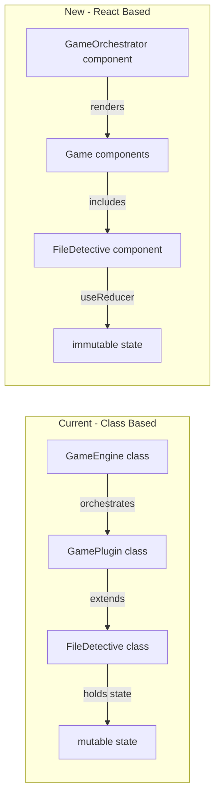
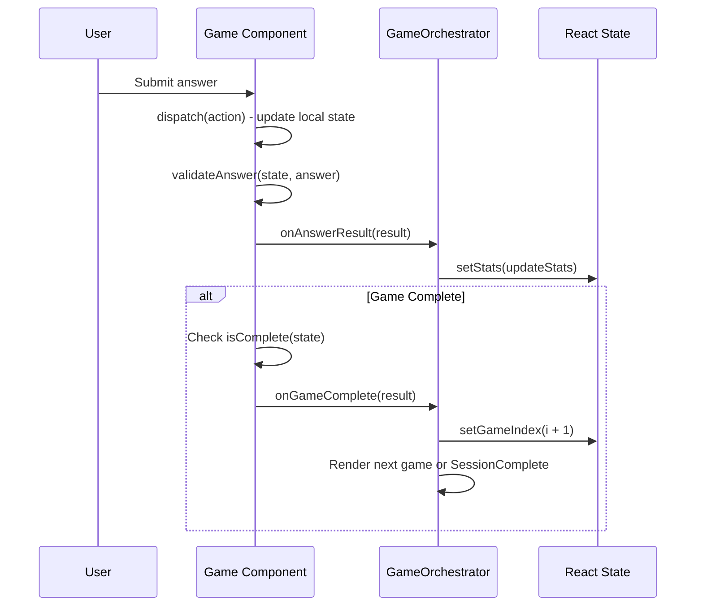

# Dynamic Plugin Architecture - React-Based

## Overview

Replace the class-based plugin system with a fully React-based architecture where:

- **Games are React components** with their own state (useReducer)
- **Orchestration happens in React** via GameOrchestrator component
- **Game logic is pure functions** for validation, state transitions
- **TypeScript config file** (like Vite/ESLint) - import games directly, no string IDs
- **No class instances holding mutable state**

## Current vs. New Architecture




## Phase 1: Core Types and Interfaces

### 1.1 Define GameProps interface

Create [src/types/game.ts](src/types/game.ts):

```typescript
import type React from "react";

export interface AnswerResult {
  correct: boolean;
  feedback: string;
  commitsEarned: number;
  isNavigation?: boolean;
}

export interface GameResult {
  completed: boolean;
  score: number;
  maxScore: number;
  timeSpent: number;
  knowledgeUnlocked: string[];
}

export interface GameProps<TConfig = unknown> {
  config: TConfig;
  onAnswerResult: (result: AnswerResult) => void;
  onGameComplete: (result: GameResult) => void;
}

export type GameComponent<TConfig = unknown> = React.ComponentType<GameProps<TConfig>>;

export interface GameMetadata {
  id: string;
  name: string;
  description: string;
  estimatedMinutes: number;
}
```

### 1.2 Define AI Context types

```typescript
export interface GameAIContext {
  gameId: string;
  gameName: string;
  purpose: string;
  configSchema: Record<string, unknown>;
  questionGuidelines: QuestionGuideline[];
  exampleConfig?: unknown;
}

export interface QuestionGuideline {
  category: string;
  description: string;
  difficulty: "easy" | "medium" | "hard";
  goodExamples: string[];
  badExamples: string[];
  principles: string[];
}
```

## Phase 2: TypeScript Config (like Vite/ESLint)

### 2.1 Config types and defineConfig helper

Add to [src/types/game.ts](src/types/game.ts):

```typescript
export interface GameInstance<TConfig = unknown> {
  id: string;
  component: GameComponent<TConfig>;
  config: TConfig;
  metadata: GameMetadata;
  getAIContext: () => GameAIContext;
}

export interface OnboardMeConfig {
  games: GameInstance[];
}

// For users: configure which games to play
export function defineConfig(config: OnboardMeConfig): OnboardMeConfig {
  return config;
}

// For game developers: create a game factory with full type inference
export interface GameDefinition<TConfig, TOptions = Partial<TConfig>> {
  id: string;
  component: GameComponent<TConfig>;
  defaultConfig: TConfig;
  metadata: GameMetadata;
  getAIContext: () => GameAIContext;
}

export function defineGame<TConfig, TOptions = Partial<TConfig>>(
  definition: GameDefinition<TConfig, TOptions>
): (options?: TOptions) => GameInstance<TConfig> {
  return (options?: TOptions) => ({
    id: definition.id,
    component: definition.component,
    config: { ...definition.defaultConfig, ...options },
    metadata: definition.metadata,
    getAIContext: definition.getAIContext,
  });
}
```

### 2.2 Game factory functions using defineGame

Each game uses `defineGame()` to create a factory function:

Create [src/games/index.ts](src/games/index.ts):

```typescript
// Export game factories for user config
export { FileDetective } from "./file-detective/index.ts";
export { FlowTrace } from "./flow-trace/index.ts";
export { GrepHunt } from "./grep-hunt/index.ts";

// Re-export config helpers for users
export { defineConfig } from "@/types/game.ts";

// Re-export defineGame for custom game developers
export { defineGame } from "@/types/game.ts";
```

Update [src/games/file-detective/index.ts](src/games/file-detective/index.ts):

```typescript
import { defineGame } from "@/types/game.ts";
import type { FileDetectiveConfig } from "./types.ts";
import { FileDetectiveComponent } from "./component.tsx";
import { getAIContext } from "./ai-context.ts";
import { defaultConfig } from "./config.ts";

// defineGame returns a factory function with full type inference
export const FileDetective = defineGame<FileDetectiveConfig>({
  id: "file-detective",
  component: FileDetectiveComponent,
  defaultConfig,
  metadata: {
    id: "file-detective",
    name: "file --detective",
    description: "Investigate a codebase to identify its project type and stack",
    estimatedMinutes: 10,
  },
  getAIContext,
});

// FileDetective is now: (options?) => GameInstance<FileDetectiveConfig>
// Usage: FileDetective({ difficulty: "hard" })
```

### 2.3 User config file

Users create `.onboardme/config.ts`:

```typescript
// .onboardme/config.ts
import { defineConfig, FileDetective, FlowTrace } from "onboardme/games";
// Or user's own game:
// import { MyCustomGame } from "./games/my-custom-game";

export default defineConfig({
  games: [
    FileDetective({ difficulty: "medium" }),
    FlowTrace(),
    // MyCustomGame(),  // User can add their own
    // GrepHunt(),      // User removed this one by not including it
  ],
});
```

### 2.4 Config loader

Create [src/core/config.ts](src/core/config.ts):

```typescript
import { join } from "node:path";
import type { OnboardMeConfig, GameInstance } from "@/types/game.ts";
import { fileExists } from "@/lib/fs.ts";
import { FileDetective, FlowTrace, GrepHunt } from "@/games/index.ts";

const CONFIG_FILE = "config.ts";

function getDefaultConfig(): OnboardMeConfig {
  return {
    games: [
      FileDetective(),
      FlowTrace(),
      GrepHunt(),
    ],
  };
}

export async function loadConfig(rootDir: string): Promise<OnboardMeConfig> {
  const configPath = join(rootDir, ".onboardme", CONFIG_FILE);
  
  if (!fileExists(configPath)) {
    return getDefaultConfig();
  }
  
  try {
    const userConfig = await import(configPath);
    return userConfig.default as OnboardMeConfig;
  } catch {
    return getDefaultConfig();
  }
}

export function getGameById(config: OnboardMeConfig, id: string): GameInstance | undefined {
  return config.games.find(g => g.id === id);
}
```

### 2.5 Benefits of this approach


| Aspect         | Old (template.json + registry) | New (config.ts)               |
| -------------- | ------------------------------ | ----------------------------- |
| Type safety    | String IDs, no autocomplete    | Full TypeScript, autocomplete |
| Adding games   | Edit JSON + register           | Just import and add to array  |
| Removing games | Delete from JSON               | Don't include in array        |
| Custom games   | Magic discovery                | Import from local path        |
| Options        | Separate options object        | Pass to factory function      |
| Validation     | Runtime string matching        | Compile-time type checking    |


## Phase 3: Game Orchestrator

### 3.1 Create GameOrchestrator component

Create [src/ui/orchestrator/game-orchestrator.tsx](src/ui/orchestrator/game-orchestrator.tsx):

```typescript
import { Box } from "ink";
import React, { useState, useCallback } from "react";
import type { AnswerResult, GameResult, OnboardMeConfig } from "@/types/game.ts";
import { Banner } from "../components/banner.tsx";
import { ScoreDisplay } from "../components/score-display.tsx";
import { SessionComplete } from "./session-complete.tsx";

interface SessionStats {
  totalCommits: number;
  correctAnswers: number;
  totalAnswers: number;
  currentStreak: number;
  longestStreak: number;
}

interface OrchestratorProps {
  config: OnboardMeConfig;
  onSessionComplete: (stats: SessionStats) => void;
}

export function GameOrchestrator({
  config,
  onSessionComplete,
}: OrchestratorProps): React.ReactElement {
  const [gameIndex, setGameIndex] = useState(0);
  const [stats, setStats] = useState<SessionStats>({
    totalCommits: 0,
    correctAnswers: 0,
    totalAnswers: 0,
    currentStreak: 0,
    longestStreak: 0,
  });

  // Direct access - no registry lookup needed!
  const currentGame = config.games[gameIndex];

  const handleAnswerResult = useCallback((result: AnswerResult) => {
    if (result.isNavigation) return;
    
    setStats(prev => {
      const newStreak = result.correct ? prev.currentStreak + 1 : 0;
      return {
        totalCommits: prev.totalCommits + result.commitsEarned,
        correctAnswers: prev.correctAnswers + (result.correct ? 1 : 0),
        totalAnswers: prev.totalAnswers + 1,
        currentStreak: newStreak,
        longestStreak: Math.max(prev.longestStreak, newStreak),
      };
    });
  }, []);

  const handleGameComplete = useCallback((_result: GameResult) => {
    const nextIndex = gameIndex + 1;
    
    if (nextIndex >= config.games.length) {
      onSessionComplete(stats);
    } else {
      setGameIndex(nextIndex);
    }
  }, [gameIndex, config.games.length, onSessionComplete, stats]);

  if (!currentGame) {
    return <SessionComplete stats={stats} />;
  }

  const GameComponent = currentGame.component;

  return (
    <Box flexDirection="column" gap={1}>
      <Banner />
      <ScoreDisplay
        totalCommits={stats.totalCommits}
        currentStreak={stats.currentStreak}
        currentQuestion={gameIndex + 1}
        totalQuestions={config.games.length}
        gameId={currentGame.id}
      />
      <GameComponent
        config={currentGame.config}
        onAnswerResult={handleAnswerResult}
        onGameComplete={handleGameComplete}
      />
    </Box>
  );
}
```

**Key points:**

- **No registry lookup** - `config.games[gameIndex]` gives us the game directly
- **Config already has everything** - component, config, metadata
- `handleAnswerResult` uses functional setState - stable callback
- Simple and straightforward React patterns

### 3.2 Data flow diagram




## Phase 4: Convert FileDetective to React Component

### 4.1 Define state and actions

Create [src/games/file-detective/state.ts](src/games/file-detective/state.ts):

```typescript
import type { FileDetectiveConfig, EvidenceCategoryId } from "./types.ts";

export type InvestigationStep = "select" | "evidence" | "deduction";

export interface FileDetectiveState {
  step: InvestigationStep;
  examined: Set<EvidenceCategoryId>;
  currentCategoryId: EvidenceCategoryId | null;
  currentQuestionIndex: number;
  caseNotes: CaseNote[];
  wrongAnswers: string[];
  startTime: number;
  totalCommits: number;
}

export interface CaseNote {
  id: string;
  categoryId: EvidenceCategoryId;
  text: string;
}

export type FileDetectiveAction =
  | { type: "SELECT_CATEGORY"; categoryId: EvidenceCategoryId }
  | { type: "START_DEDUCTION" }
  | { type: "SUBMIT_ANSWER"; answer: string; correct: boolean }
  | { type: "WRONG_ANSWER"; answer: string }
  | { type: "ADD_COMMITS"; amount: number }
  | { type: "RESET_WRONG_ANSWERS" };

export function createInitialState(): FileDetectiveState {
  return {
    step: "select",
    examined: new Set(),
    currentCategoryId: null,
    currentQuestionIndex: 0,
    caseNotes: [],
    wrongAnswers: [],
    startTime: Date.now(),
    totalCommits: 0,
  };
}
```

### 4.2 Create reducer

Create [src/games/file-detective/reducer.ts](src/games/file-detective/reducer.ts):

```typescript
import type { FileDetectiveState, FileDetectiveAction } from "./state.ts";

export function fileDetectiveReducer(
  state: FileDetectiveState,
  action: FileDetectiveAction
): FileDetectiveState {
  switch (action.type) {
    case "SELECT_CATEGORY":
      return {
        ...state,
        step: "evidence",
        currentCategoryId: action.categoryId,
        currentQuestionIndex: 0,
        wrongAnswers: [],
      };

    case "START_DEDUCTION":
      return {
        ...state,
        step: "deduction",
        currentCategoryId: null,
        wrongAnswers: [],
      };

    case "SUBMIT_ANSWER":
      if (!action.correct) {
        return {
          ...state,
          wrongAnswers: [...state.wrongAnswers, action.answer],
        };
      }
      // Handle correct answer based on current step
      return handleCorrectAnswer(state, action.answer);

    case "ADD_COMMITS":
      return {
        ...state,
        totalCommits: state.totalCommits + action.amount,
      };

    case "RESET_WRONG_ANSWERS":
      return {
        ...state,
        wrongAnswers: [],
      };

    default:
      return state;
  }
}

function handleCorrectAnswer(state: FileDetectiveState, answer: string): FileDetectiveState {
  // Implementation based on current step
  // ... (logic extracted from current FileDetective class)
}
```

### 4.3 Extract pure logic functions

Create [src/games/file-detective/logic.ts](src/games/file-detective/logic.ts):

```typescript
import type { FileDetectiveConfig } from "./types.ts";
import type { FileDetectiveState } from "./state.ts";
import type { AnswerResult, GameResult } from "@/types/game.ts";

export function validateAnswer(
  state: FileDetectiveState,
  config: FileDetectiveConfig,
  answer: string
): AnswerResult {
  if (state.step === "select") {
    return validateSelectAnswer(state, config, answer);
  }
  if (state.step === "evidence") {
    return validateEvidenceAnswer(state, config, answer);
  }
  return validateDeductionAnswer(state, config, answer);
}

export function isComplete(state: FileDetectiveState): boolean {
  return state.step === "deduction" && state.examined.size >= 5;
}

export function getResult(state: FileDetectiveState): GameResult {
  return {
    completed: isComplete(state),
    score: state.totalCommits,
    maxScore: 100,
    timeSpent: Date.now() - state.startTime,
    knowledgeUnlocked: state.caseNotes.map(n => n.text),
  };
}

export function getCurrentQuestion(
  state: FileDetectiveState,
  config: FileDetectiveConfig
): GameQuestion | null {
  // Build question based on current step
  // ... (logic extracted from current FileDetective class)
}

// Pure validation functions
function validateSelectAnswer(...): AnswerResult { ... }
function validateEvidenceAnswer(...): AnswerResult { ... }
function validateDeductionAnswer(...): AnswerResult { ... }
```

### 4.4 Create FileDetective component

Create [src/games/file-detective/component.tsx](src/games/file-detective/component.tsx):

```typescript
import React, { useReducer, useCallback, useEffect } from "react";
import type { GameProps } from "@/types/game.ts";
import type { FileDetectiveConfig } from "./types.ts";
import { createInitialState } from "./state.ts";
import { fileDetectiveReducer } from "./reducer.ts";
import { validateAnswer, isComplete, getResult, getCurrentQuestion } from "./logic.ts";
import { FileDetectiveUI } from "./ui.tsx";

export function FileDetective({
  config,
  onAnswerResult,
  onGameComplete,
}: GameProps<FileDetectiveConfig>): React.ReactElement {
  const [state, dispatch] = useReducer(fileDetectiveReducer, undefined, createInitialState);

  const handleSubmit = useCallback((answer: string) => {
    const result = validateAnswer(state, config, answer);
    
    dispatch({ type: "SUBMIT_ANSWER", answer, correct: result.correct });
    
    if (result.correct) {
      dispatch({ type: "ADD_COMMITS", amount: result.commitsEarned });
    }
    
    onAnswerResult(result);
  }, [state, config, onAnswerResult]);

  // Check completion after state updates
  useEffect(() => {
    if (isComplete(state)) {
      onGameComplete(getResult(state));
    }
  }, [state, onGameComplete]);

  const handleSelectCategory = useCallback((id: string) => {
    dispatch({ type: "SELECT_CATEGORY", categoryId: id });
  }, []);

  const handleStartDeduction = useCallback(() => {
    dispatch({ type: "START_DEDUCTION" });
  }, []);

  const currentQuestion = getCurrentQuestion(state, config);

  return (
    <FileDetectiveUI
      state={state}
      config={config}
      currentQuestion={currentQuestion}
      onSubmit={handleSubmit}
      onSelectCategory={handleSelectCategory}
      onStartDeduction={handleStartDeduction}
    />
  );
}
```

**Key points:**

- `handleSubmit` has dependencies - that's fine, callback recreates when state changes
- Completion check via `useEffect` - clean separation of concerns
- Action dispatchers are stable (no deps needed since they only call dispatch)
- `currentQuestion` derived during render (no useMemo needed for simple derivation)

### 4.5 Create UI component

Create [src/games/file-detective/ui.tsx](src/games/file-detective/ui.tsx):

```typescript
import React from "react";
import { Box } from "ink";
import type { FileDetectiveState } from "./state.ts";
import type { FileDetectiveConfig } from "./types.ts";
import type { GameQuestion } from "@/types/game.ts";
import { EvidenceBoard } from "@/ui/components/evidence-board.tsx";
import { Question } from "@/ui/components/question.tsx";
import { CaseNotes } from "@/ui/components/case-notes.tsx";

interface FileDetectiveUIProps {
  state: FileDetectiveState;
  config: FileDetectiveConfig;
  currentQuestion: GameQuestion | null;
  onSubmit: (answer: string) => void;
  onSelectCategory: (id: string) => void;
  onStartDeduction: () => void;
}

export function FileDetectiveUI({
  state,
  config,
  currentQuestion,
  onSubmit,
  onSelectCategory,
  onStartDeduction,
}: FileDetectiveUIProps): React.ReactElement {
  return (
    <Box flexDirection="column" gap={1}>
      <EvidenceBoard
        categories={config.evidence}
        examined={state.examined}
        onSelect={onSelectCategory}
        onStartDeduction={onStartDeduction}
        canStartDeduction={state.examined.size >= config.requiredEvidence}
      />
      {currentQuestion && (
        <Question
          question={currentQuestion}
          onSubmit={onSubmit}
          wrongAnswers={state.wrongAnswers}
        />
      )}
      <CaseNotes notes={state.caseNotes} />
    </Box>
  );
}
```

### 4.6 Export game as factory function

The factory function was already defined in Phase 2.2. Here's a reminder of the pattern:

```typescript
// src/games/file-detective/index.ts
export function FileDetective(options?: FileDetectiveOptions): GameInstance<FileDetectiveConfig> {
  return {
    id: "file-detective",
    component: FileDetectiveComponent,
    config: { ...defaultConfig, ...options },
    metadata: { /* ... */ },
    getAIContext,
  };
}
```

**Benefits of factory functions:**

- Users call `FileDetective({ difficulty: "hard" })` in their config
- Options are passed directly, no separate config file
- Full TypeScript inference and autocomplete
- Familiar pattern from ESLint flat config, Vite plugins

## Phase 5: Update Start Command

### 5.1 Refactor start command

Update [src/commands/start.tsx](src/commands/start.tsx):

```typescript
import { render } from "ink";
import React from "react";
import { GameOrchestrator } from "@/ui/orchestrator/game-orchestrator.tsx";
import { loadConfig } from "@/core/config.ts";

export async function startCommand(rootDir: string): Promise<void> {
  // Load config (user's or default)
  const config = await loadConfig(rootDir);
  
  // Render orchestrator - config has everything needed
  const { waitUntilExit } = render(
    <GameOrchestrator
      config={config}
      onSessionComplete={(stats) => {
        console.log("Session complete!", stats);
      }}
    />
  );
  
  await waitUntilExit();
}
```

**Simplified:**

- No registration step
- No template loading
- No prepared data loading (config includes game configs)
- Just load config and render

## Phase 6: Simplify E2E Testing

### 6.1 Test game components directly

Update [tests/e2e/framework/index.ts](tests/e2e/framework/index.ts):

```typescript
import { render } from "ink-testing-library";
import type { GameComponent } from "@/types/game.ts";

interface E2EOptions<TConfig> {
  GameComponent: GameComponent<TConfig>;
  config: TConfig;
}

export async function withGameE2E<TConfig>(
  options: E2EOptions<TConfig>,
  testFn: (e2e: E2EHelper) => Promise<void>
): Promise<void> {
  const results: AnswerResult[] = [];
  let gameResult: GameResult | null = null;

  const { lastFrame, stdin } = render(
    <options.GameComponent
      config={options.config}
      onAnswerResult={(r) => results.push(r)}
      onGameComplete={(r) => { gameResult = r; }}
    />
  );

  const e2e: E2EHelper = {
    lastFrame,
    press: (key) => stdin.write(keyMap[key]),
    type: (text) => stdin.write(text),
    getResults: () => results,
    getGameResult: () => gameResult,
    debug: (label) => console.log(`[${label}]\n${lastFrame()}`),
  };

  await testFn(e2e);
}
```

### 6.2 Example test

```typescript
import { FileDetective } from "@/games/file-detective/component.tsx";
import { FILE_DETECTIVE_TEST_CONFIG } from "./configs/file-detective.ts";

await withGameE2E({
  GameComponent: FileDetective,
  config: FILE_DETECTIVE_TEST_CONFIG,
}, async (e2e) => {
  e2e.debug("Initial");
  await e2e.press("enter");
  await e2e.press("down");
  await e2e.press("enter");
  expect(e2e.lastFrame()).toContain("Evidence");
});
```

## Phase 7: CLI Helper Commands

### 7.1 Game scaffold command

`onboardme game:new <id>` creates a minimal game with working boilerplate:

```
src/games/{id}/
├── index.ts           # defineGame() export
├── component.tsx      # React component with useReducer
├── types.ts           # Config types with Zod schema
└── ai-context.ts      # AI context for question generation
```

**Generated `index.ts` template:**

```typescript
import { defineGame } from "@/types/game.ts";
import type { ${PascalId}Config } from "./types.ts";
import { ${PascalId}Component } from "./component.tsx";
import { getAIContext } from "./ai-context.ts";
import { defaultConfig } from "./types.ts";

// defineGame returns a factory function: (options?) => GameInstance
export const ${PascalId} = defineGame<${PascalId}Config>({
  id: "${id}",
  component: ${PascalId}Component,
  defaultConfig,
  metadata: {
    id: "${id}",
    name: "${name}",
    description: "TODO: Add description",
    estimatedMinutes: 5,
  },
  getAIContext,
});
```

**Generated `component.tsx` template:**

```typescript
import React, { useReducer, useCallback, useEffect } from "react";
import { Box } from "ink";
import type { GameProps } from "@/types/game.ts";
import type { ${PascalId}Config } from "./types.ts";

interface State {
  questionIndex: number;
  startTime: number;
}

type Action = { type: "NEXT_QUESTION" };

function reducer(state: State, action: Action): State {
  switch (action.type) {
    case "NEXT_QUESTION":
      return { ...state, questionIndex: state.questionIndex + 1 };
    default:
      return state;
  }
}

export function ${PascalId}Component({
  config,
  onAnswerResult,
  onGameComplete,
}: GameProps<${PascalId}Config>): React.ReactElement {
  const [state, dispatch] = useReducer(reducer, {
    questionIndex: 0,
    startTime: Date.now(),
  });

  const handleSubmit = useCallback((answer: string) => {
    // TODO: Implement validation logic
    onAnswerResult({ correct: true, feedback: "", commitsEarned: 10 });
    dispatch({ type: "NEXT_QUESTION" });
  }, [state, config, onAnswerResult]);

  // TODO: Implement UI
  return <Box>TODO: Implement game</Box>;
}
```

### 7.2 Add to user config

After scaffolding, user adds the game to their config:

```typescript
// .onboardme/config.ts
import { defineConfig, FileDetective } from "onboardme/games";
import { ${PascalId} } from "./games/${id}";

export default defineConfig({
  games: [
    FileDetective(),
    ${PascalId}({ difficulty: "medium" }),  // New game!
  ],
});
```

### 7.3 Prepare scaffold command (optional, for AI)

`onboardme prepare:scaffold` reads config and generates placeholder JSON for AI:

```bash
# Reads .onboardme/config.ts, outputs placeholder files
onboardme prepare:scaffold

# Output:
# Created .onboardme/prepared/file-detective.json (placeholder)
# Created .onboardme/prepared/flow-trace.json (placeholder)
#
# Next: Run your AI skill to fill in the placeholders based on:
# - Game AI context from each game's getAIContext()
# - Target codebase analysis
```

### 7.4 DX improvements for game developers

**Clear error messages in config loader:**

```typescript
// In src/core/config.ts
export async function loadConfig(rootDir: string): Promise<OnboardMeConfig> {
  const configPath = join(rootDir, ".onboardme", "config.ts");
  
  if (!fileExists(configPath)) {
    return getDefaultConfig();
  }
  
  try {
    const userConfig = await import(configPath);
    
    if (!userConfig.default) {
      throw new Error(
        `Config file must export default. Use: export default defineConfig({ ... })`
      );
    }
    
    if (!Array.isArray(userConfig.default.games)) {
      throw new Error(
        `Config must have a games array. Use: defineConfig({ games: [...] })`
      );
    }
    
    return userConfig.default;
  } catch (error) {
    console.error(`Failed to load config: ${error.message}`);
    return getDefaultConfig();
  }
}
```

**Type-safe config with Zod (generated by scaffold):**

```typescript
// In types.ts (generated by scaffold)
import { z } from "zod";

export const ${PascalId}ConfigSchema = z.object({
  difficulty: z.enum(["easy", "medium", "hard"]).default("medium"),
  questions: z.array(z.object({
    text: z.string(),
    answer: z.string(),
    hints: z.array(z.string()).optional(),
  })),
});

export type ${PascalId}Config = z.infer<typeof ${PascalId}ConfigSchema>;

export const defaultConfig: ${PascalId}Config = {
  difficulty: "medium",
  questions: [],
};
```

## File Changes Summary


| File                                        | Change Type | Description                                           |
| ------------------------------------------- | ----------- | ----------------------------------------------------- |
| `src/types/game.ts`                         | Create      | GameProps, GameInstance, defineConfig(), defineGame() |
| `src/core/config.ts`                        | Create      | Config loader (replaces template.ts)                  |
| `src/games/index.ts`                        | Create      | Export game factories + defineConfig                  |
| `src/games/file-detective/component.tsx`    | Create      | React component with useReducer                       |
| `src/games/file-detective/state.ts`         | Create      | State types and createInitialState                    |
| `src/games/file-detective/reducer.ts`       | Create      | Pure reducer for state transitions                    |
| `src/games/file-detective/logic.ts`         | Create      | Pure validation functions                             |
| `src/games/file-detective/ui.tsx`           | Create      | Presentational UI component                           |
| `src/games/file-detective/index.ts`         | Modify      | Export factory function FileDetective()               |
| `src/games/file-detective/ai-context.ts`    | Create      | AI context with QuestionGuidelines                    |
| `src/ui/orchestrator/game-orchestrator.tsx` | Create      | Orchestrator component                                |
| `src/ui/orchestrator/session-complete.tsx`  | Create      | Session complete screen                               |
| `src/ui/screens/game-screen.tsx`            | Delete      | Replaced by orchestrator                              |
| `src/ui/screens/file-detective-game.tsx`    | Delete      | Moved to games/file-detective/ui.tsx                  |
| `src/core/engine.ts`                        | Delete      | No longer needed                                      |
| `src/core/plugin.ts`                        | Delete      | No longer needed                                      |
| `src/core/bootstrap.ts`                     | Delete      | No longer needed                                      |
| `src/core/template.ts`                      | Delete      | Replaced by config.ts                                 |
| `src/commands/start.tsx`                    | Modify      | Use loadConfig + orchestrator                         |
| `src/commands/game-new.ts`                  | Create      | CLI scaffold command                                  |
| `tests/e2e/framework/index.ts`              | Modify      | Render game components directly                       |
| `tests/e2e/adapters/`                       | Delete      | No longer needed                                      |


## Migration Path

1. **Phase 1**: Define types (GameProps, GameInstance, defineConfig, defineGame)
2. **Phase 2**: Create config loader and game factories using defineGame
3. **Phase 3**: Create GameOrchestrator component
4. **Phase 4**: Convert FileDetective to React component
5. **Phase 5**: Update start command to use config + orchestrator
6. **Phase 6**: Simplify E2E testing
7. **Phase 7**: Add CLI helper commands
8. **Phase 8**: Remove old code (GamePlugin, GameEngine, template.ts)

## React Best Practices Applied

Simple, pragmatic patterns - no over-engineering:


| Pattern                      | Where Applied                        | Benefit                          |
| ---------------------------- | ------------------------------------ | -------------------------------- |
| Functional setState          | `handleAnswerResult` in Orchestrator | Stable callback, uses prev state |
| useEffect for side effects   | Completion check in FileDetective    | Clean separation of concerns     |
| useReducer for complex state | FileDetective game state             | Predictable state transitions    |
| Derived values in render     | `currentQuestion`                    | No state drift, always in sync   |
| Direct array access          | `config.games[index]`                | No map lookup needed             |


## DX Patterns from Popular Frameworks


| Pattern             | Inspiration             | Where Used                          |
| ------------------- | ----------------------- | ----------------------------------- |
| `defineConfig()`    | Vite's `defineConfig()` | User config with type inference     |
| `defineGame()`      | Vite plugins            | Game definition with type inference |
| Factory functions   | ESLint flat config      | `FileDetective({ options })`        |
| Import what you use | Tailwind, ESLint        | No string IDs, direct imports       |
| Type inference      | tRPC, Zod               | Config types inferred from schema   |
| Minimal boilerplate | TanStack                | 4-file scaffold vs 8 files          |
| Schema validation   | Zod                     | Config validation with safeParse    |


## Benefits of New Architecture


| Aspect           | Old (Class + Template)          | New (React + Config)            |
| ---------------- | ------------------------------- | ------------------------------- |
| State visibility | Hidden in class                 | React DevTools                  |
| State updates    | Mutable, manual refresh         | Immutable, automatic re-render  |
| Testing          | Mock class instances            | Render component, assert output |
| Type safety      | String IDs, cast plugin types   | Full TypeScript, no casts       |
| Debugging        | Console.log in class            | React DevTools                  |
| Adding games     | Register + add to template JSON | Import and add to config array  |
| Removing games   | Delete from JSON                | Don't include in config array   |
| Custom games     | Magic discovery                 | Import from local path          |
| Code style       | OOP with inheritance            | Functional with hooks           |


