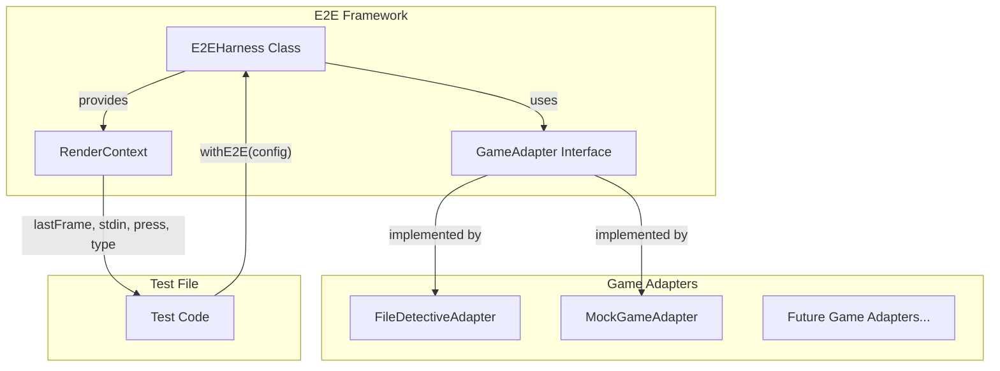

# E2E Testing Framework

## Goal

Transform the current ad-hoc E2E test setup into a scalable framework with:

- Game-agnostic test harness that receives UI components externally
- Unified API that combines engine setup, rendering, and interaction
- Clean DX with minimal boilerplate per test

## Architecture




## Key Components

### 1. Game Adapter Interface

Each game implements an adapter that knows how to extract state and provide callbacks.

```typescript
// tests/e2e/framework/types.ts
interface GameAdapter<TState = unknown> {
  extractState(engine: GameEngine): TState | null;
  createCallbacks(submitAnswer: (answer: string) => Promise<void>): GameCallbacks;
  render(props: GameRenderProps<TState>): React.ReactElement;
}
```

### 2. E2E Harness Class

Combines `GameTestHarness` + `inkRender` + state management into one class.

```typescript
// tests/e2e/framework/harness.ts
class E2EHarness {
  readonly engine: GameEngine;
  readonly stdin: { write(input: string): void };
  
  lastFrame(): string;
  press(key: 'enter' | 'up' | 'down' | 'left' | 'right'): Promise<void>;
  type(text: string): Promise<void>;
  waitFor(condition: (frame: string) => boolean, timeout?: number): Promise<void>;
  debug(label?: string): void;
}
```

### 3. Factory Function

Clean entry point for tests.

```typescript
// tests/e2e/framework/index.ts
async function withE2E<T>(
  options: E2EOptions,
  fn: (harness: E2EHarness) => Promise<T>
): Promise<T>;
```

## File Structure

```
tests/e2e/
├── framework/
│   ├── index.ts           # Public API exports
│   ├── harness.ts         # E2EHarness class
│   ├── types.ts           # Interfaces and types
│   ├── render-wrapper.tsx # Generic game screen component
│   └── keys.ts            # Key codes constants
├── adapters/
│   ├── file-detective.ts  # FileDetective adapter
│   └── mock-game.ts       # MockGame adapter (for testing the framework)
├── configs/
│   └── file-detective.ts  # Test configs (moved from test-utils.ts)
└── simple.test.ts         # Example test using the framework
```

## Usage Example (Target DX)

```typescript
import { withE2E } from "./framework";
import { fileDetectiveAdapter, FILE_DETECTIVE_CONFIG } from "./adapters/file-detective";

describe("E2E: File Detective", () => {
  it("plays through the game", async () => {
    await withE2E({
      game: {
        id: "file-detective",
        plugin: FileDetective,
        config: FILE_DETECTIVE_CONFIG,
      },
      adapter: fileDetectiveAdapter,
    }, async (e2e) => {
      e2e.debug("Initial");
      
      await e2e.press("enter");  // Select first option
      e2e.debug("After selection");
      
      await e2e.type("package.json");
      await e2e.press("enter");
      
      e2e.debug("After answer");
      expect(e2e.lastFrame()).toContain("Root Files");
    });
  });
});
```

## Implementation Steps

### Step 1: Create framework structure

- Create `tests/e2e/framework/` directory
- Add `types.ts` with interfaces
- Add `keys.ts` with key code constants

### Step 2: Implement E2EHarness

- Create `harness.ts` with `E2EHarness` class
- Wrap `GameTestHarness` creation
- Wrap `inkRender` with the generic render component
- Add helper methods (`press`, `type`, `debug`, `waitFor`)

### Step 3: Create generic render wrapper

- Create `render-wrapper.tsx` that accepts a `GameAdapter`
- Move state management logic from `test-game-screen.tsx`
- Make it game-agnostic using the adapter pattern

### Step 4: Implement FileDetective adapter

- Create `adapters/file-detective.ts`
- Extract state extraction logic from current `TestGameScreen`
- Move config to `configs/file-detective.ts`

### Step 5: Create public API

- Create `framework/index.ts` with `withE2E` function
- Export types and utilities

### Step 6: Update test file

- Refactor `simple.test.ts` to use new framework
- Remove old `test-game-screen.tsx` and `test-utils.ts`

## Files to Create/Modify


| File                                     | Action                           |
| ---------------------------------------- | -------------------------------- |
| `tests/e2e/framework/types.ts`           | Create                           |
| `tests/e2e/framework/keys.ts`            | Create                           |
| `tests/e2e/framework/harness.ts`         | Create                           |
| `tests/e2e/framework/render-wrapper.tsx` | Create                           |
| `tests/e2e/framework/index.ts`           | Create                           |
| `tests/e2e/adapters/file-detective.ts`   | Create                           |
| `tests/e2e/configs/file-detective.ts`    | Create (move from test-utils.ts) |
| `tests/e2e/simple.test.ts`               | Refactor                         |
| `tests/e2e/test-game-screen.tsx`         | Delete                           |
| `tests/e2e/test-utils.ts`                | Delete                           |


