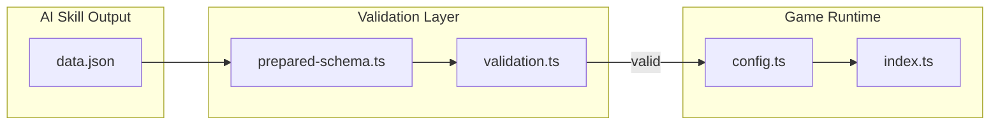

# File Detective Prepared Data Schema

## Context

Task 3.2 builds upon the completed task 3.1, which established:

- TypeScript types in [src/games/file-detective/types.ts](src/games/file-detective/types.ts)
- JSON Schema definitions in [src/games/file-detective/schema.ts](src/games/file-detective/schema.ts) (for plugin requirements)
- Config parsing in [src/games/file-detective/config.ts](src/games/file-detective/config.ts) (manual normalization)

The goal is to add Zod-based validation so prepared data from AI skills can be properly validated before the game runs.

## Data Flow




## File 1: `src/games/file-detective/prepared-schema.ts`

Define Zod schemas mirroring the types in `types.ts`:

- `EvidenceCategoryIdSchema` - literal union of 5 category IDs
- `EvidenceQuestionSchema` - `{ id: string, prompt: string, options?: string[] }`
- `EvidenceCategorySchema` - `{ id, title, description, questions[] }`
- `ProjectTypeInfoSchema` - `{ projectType, language, framework, architecture? }`
- `DeductionOptionSchema` - `{ id, label, matches: ProjectTypeInfoSchema }`
- `DeductionConfigSchema` - `{ prompt, options[], correctId }`
- `FileDetectivePreparedDataSchema` - top-level schema for `data.json`

The prepared data structure expected at `.onboardme/prepared/games/file-detective/data.json`:

```typescript
{
  config: {
    projectType: ProjectTypeInfo,
    evidence: EvidenceCategory[],
    deduction: DeductionConfig
  },
  questions: [] // Not used by file-detective (dynamic generation)
}
```

Key validation rules:

- Evidence must have all 5 category IDs
- Each category must have at least 1 question
- Deduction `correctId` must reference an existing option ID
- At least 2 deduction options required

## File 2: Update `src/services/validation.ts`

Add file-detective validation alongside existing manifest validation:

- `validateFileDetectiveData(rootDir: string)` - validates prepared data for file-detective
- Use `getGameDataPath()` from [src/core/loader.ts](src/core/loader.ts) to locate data file
- Return `ValidationResult` (same interface as `validateManifest`)

## Integration Points

- Loader ([src/core/loader.ts](src/core/loader.ts)) already handles reading `data.json`
- Config parser ([src/games/file-detective/config.ts](src/games/file-detective/config.ts)) can optionally call schema validation before parsing
- Engine can validate game data during initialization

