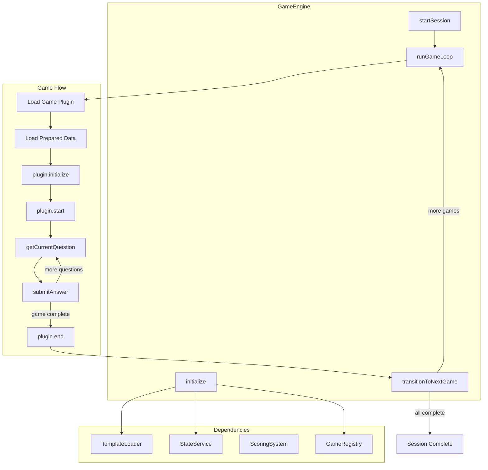

# Game Engine Implementation

## Overview

The Game Engine is the orchestrator that ties together the plugin system, template loader, scoring, and state management. It runs games in sequence, handles transitions, and persists progress.

## Architecture




## Key Design Decisions

1. **Game Registry Pattern**: A registry maps game IDs to plugin constructors, enabling dynamic instantiation
2. **Callback-Based UI Integration**: Simple optional callbacks passed in config (not an EventEmitter) - sufficient since only the UI consumes these and we don't need dynamic subscription
3. **Stateless Engine**: Engine doesn't hold game state - it delegates to plugins and state service
4. **Fail-Fast Validation**: Validate all games exist and have prepared data before starting

## Files to Create

### 1. [src/core/engine.ts](src/core/engine.ts) - Main Engine (~150 lines)

Core engine class with:

```typescript
interface GameEngineConfig {
  rootDir: string;
  onQuestionStart?: (game: string, question: GameQuestion) => void;
  onAnswerResult?: (result: AnswerResult) => void;
  onGameComplete?: (game: string, result: GameResult) => void;
  onSessionComplete?: (stats: SessionStats) => void;
}

class GameEngine {
  async initialize(): Promise<EngineInitResult>
  async startSession(): Promise<void>
  async submitAnswer(answer: string): Promise<AnswerResult>
  getCurrentQuestion(): GameQuestion | null
  getCurrentGameId(): string | null
  getProgress(): EngineProgress
  async resumeSession(): Promise<boolean>
}
```

Key methods:

- `initialize()` - Load template, validate prepared data exists, resolve game order
- `startSession()` - Start from first game (or resume from checkpoint)
- `submitAnswer()` - Submit answer to current game, update state, handle transitions
- `getCurrentQuestion()` - Get current question from active plugin
- `resumeSession()` - Resume from saved checkpoint if available

### 2. [src/core/registry.ts](src/core/registry.ts) - Game Registry (~50 lines)

Registry for game plugin constructors:

```typescript
type GamePluginConstructor = new () => GamePlugin;

const gameRegistry = new Map<string, GamePluginConstructor>();

function registerGame(id: string, plugin: GamePluginConstructor): void
function getGamePlugin(id: string): GamePluginConstructor | undefined
function hasGame(id: string): boolean
function getRegisteredGames(): string[]
```

### 3. [src/core/loader.ts](src/core/loader.ts) - Prepared Data Loader (~60 lines)

Load prepared data for games:

```typescript
interface PreparedDataLoader {
  loadGameData(rootDir: string, gameId: string): Promise<GamePreparedData | null>
  validateGameData(rootDir: string, gameId: string): Promise<boolean>
  getGameDataPath(rootDir: string, gameId: string): string
}
```

Reads from `.onboardme/prepared/games/{gameId}/` directory.

### 4. [src/types/engine.ts](src/types/engine.ts) - Engine Types (~40 lines)

```typescript
interface EngineInitResult {
  success: boolean;
  games: ResolvedGame[];
  errors: string[];
}

interface EngineProgress {
  currentGameIndex: number;
  totalGames: number;
  currentGameId: string | null;
  currentQuestionIndex: number;
  totalQuestions: number;
  sessionStats: SessionStats;
}

interface EngineCallbacks {
  onQuestionStart?: (gameId: string, question: GameQuestion) => void;
  onAnswerResult?: (result: AnswerResult, stats: { streak: number }) => void;
  onGameComplete?: (gameId: string, result: GameResult) => void;
  onSessionComplete?: (stats: SessionStats) => void;
}
```

## Engine Flow

### Initialization Flow

1. Load template using `loadTemplate()`
2. Load manifest using `loadManifest()`
3. Resolve game order using `resolveGameOrder()`
4. Validate each game has prepared data
5. Return success/error with resolved games list

### Game Loop Flow

1. Get current game from resolved order
2. Instantiate plugin from registry
3. Load prepared data for game
4. Call `plugin.initialize(preparedData)`
5. Call `plugin.start()`
6. Save checkpoint via state service
7. Loop: `getCurrentQuestion()` -> wait for answer -> `submitAnswer()` -> update state
8. When `plugin.isComplete()`: call `plugin.end()`, save result, transition

### State Coordination

The engine coordinates with existing state service methods:

- `startGame(rootDir, gameId)` - When starting a new game
- `advanceQuestion(rootDir)` - After each answer
- `recordAnswer(rootDir, correct, commits, timeMs)` - After each answer
- `completeGame(rootDir, gameId, result)` - When game ends
- `saveCheckpoint(rootDir)` - Periodically during play

## Integration Points

### With Template Loader

```typescript
const { template, source } = await loadTemplate(rootDir);
const manifest = await loadManifest(rootDir);
const { success, games, errors } = resolveGameOrder(template, manifest);
```

### With Scoring System

```typescript
const config = createDefaultScoringConfig();
let streakState = createInitialStreakState();

// On answer:
const commits = calculateScore({
  correct,
  answerTimeMs,
  currentStreak: streakState.currentStreak,
  config
});
streakState = updateStreak(correct, streakState);
```

### With State Service

Uses existing functions from `src/services/state.ts` - no modifications needed.

## Testing Strategy

Tests will be added in task 2.7 (Mock Game for Testing) with integration tests in `tests/integration/engine.test.ts`.

## Export Updates

Update [src/core/index.ts](src/core/index.ts) to export:

- `GameEngine` class
- `registerGame`, `getGamePlugin` from registry
- `loadGameData` from loader
- Engine types

