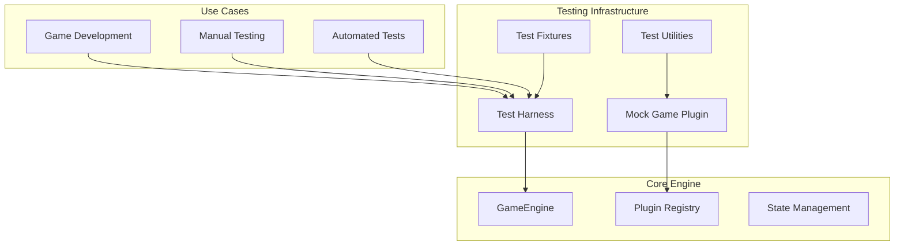

# Game Testing Framework for OnboardMe

This plan creates a robust, reusable testing infrastructure that serves as the foundation for all game development. The framework enables:

- Automated testing of the game engine end-to-end
- Isolated testing of individual game concepts
- Manual testing via CLI for rapid iteration
- Fixture generation for consistent test scenarios

---

## Architecture Overview




---

## 1. Mock Game Plugin

Create a configurable mock game that can simulate various game scenarios.

**File**: `src/games/mock/index.ts`

Key features:

- Configurable number of questions
- Configurable answer validation (accept specific answers or patterns)
- Configurable delays for async behavior testing
- Support for all question types (`multiple-choice`, `text-input`, `marker`, `timed`)
- Configurable knowledge unlocks
- Lifecycle hook tracking for verification

```typescript
export interface MockGameConfig {
  questionCount: number;
  acceptedAnswer?: string | RegExp;
  questionType?: QuestionType;
  simulateDelay?: number;
  knowledgePerQuestion?: string[];
}

export class MockGame extends GamePlugin {
  readonly schema: GamePluginSchema = {
    id: "mock-game",
    name: "mock --game",
    description: "Test game for engine validation",
    estimatedTime: 1,
    requiredContext: [],
  };
  // ... configurable implementation
}
```

Register as default in the mock module for easy use.

---

## 2. Test Harness

A dedicated harness that wraps the engine for isolated testing with full control.

**File**: `src/testing/harness.ts`

Key capabilities:

- Create isolated test environments with temporary directories
- Auto-generate prepared data fixtures
- Mock the registry to isolate specific games
- Capture all callbacks for assertion
- Simulate answer sequences programmatically
- Clean up after tests

```typescript
export interface TestHarnessOptions {
  games: Array<{
    id: string;
    plugin: GamePluginConstructor;
    questions: GameQuestion[];
  }>;
  autoStart?: boolean;
}

export class GameTestHarness {
  engine: GameEngine;
  capturedCallbacks: CapturedCallbacks;
  
  static async create(options: TestHarnessOptions): Promise<GameTestHarness>;
  async submitAnswerSequence(answers: string[]): Promise<AnswerResult[]>;
  async playThrough(): Promise<SessionStats>;
  async cleanup(): Promise<void>;
}
```

---

## 3. Test Utilities

Shared utilities for creating test data consistently.

**File**: `src/testing/utils.ts`

Utilities to create:

- Test questions (all types)
- Prepared data structures
- Manifest fixtures
- Template fixtures
- Mock callbacks with capture capability

```typescript
export function createTestQuestion(overrides?: Partial<GameQuestion>): GameQuestion;
export function createMultipleChoiceQuestion(options: string[], correctIndex: number): GameQuestion;
export function createPreparedData(questions: GameQuestion[]): GamePreparedData;
export function createMockCallbacks(): { callbacks: EngineCallbacks; captured: CapturedCallbacks };
```

---

## 4. Test Fixtures Generator

Generate complete fixture directories for testing.

**File**: `src/testing/fixtures.ts`

Creates the complete `.onboardme/` structure:

- `prepared/manifest.json`
- `prepared/games/{gameId}/data.json`
- `state/progress.json` (optional, for resume testing)

```typescript
export interface FixtureOptions {
  games: Array<{ id: string; questions: GameQuestion[] }>;
  includeProgress?: boolean;
  progressState?: Partial<Progress>;
}

export async function createTestFixtures(
  rootDir: string, 
  options: FixtureOptions
): Promise<void>;
```

---

## 5. CLI Test Runner

A CLI subcommand or standalone runner for manual testing.

**File**: `src/testing/runner.ts`

Two modes:

1. **Interactive mode**: Play through a mock game in the terminal
2. **Automated mode**: Run test sequences and output results

Usage:

```bash
# Run mock game with 5 questions interactively
bun run src/testing/runner.ts --game mock --questions 5

# Run automated sequence
bun run src/testing/runner.ts --game mock --answers "a,b,c,correct,correct"
```

This enables rapid manual testing without needing full prepare/init cycles.

---

## 6. Integration Tests

**File**: `tests/integration/engine.test.ts`

Test scenarios:

- Engine initialization with valid/invalid data
- Full game playthrough with mock game
- Multi-game session (transition between games)
- State persistence and resume functionality
- Callback invocation verification
- Scoring and streak calculation
- Error handling (missing data, unregistered plugins)

---

## File Structure

```
src/
├── games/
│   └── mock/
│       └── index.ts           # Mock game plugin
├── testing/
│   ├── index.ts               # Public exports
│   ├── harness.ts             # Test harness class
│   ├── utils.ts               # Test utilities
│   ├── fixtures.ts            # Fixture generator
│   └── runner.ts              # CLI test runner
tests/
├── integration/
│   └── engine.test.ts         # Engine integration tests
└── fixtures/
    └── games/                 # Static test fixtures
        └── mock/
            └── data.json
```

---

## Key Design Decisions

1. **Harness creates temp directories** - Each test gets isolated environment, prevents cross-contamination
2. **Mock game is configurable** - Single mock serves all test scenarios via options
3. **Fixtures are generated, not static** - Dynamic generation ensures they match current schemas
4. **CLI runner uses same harness** - Consistent behavior between manual and automated testing
5. **Callback capture built-in** - Every test can verify the exact sequence of events

---

## Dependencies on Existing Code

The testing framework leverages:

- `src/core/engine.ts` - `GameEngine` class (no changes needed)
- `src/core/plugin.ts` - `GamePlugin` base class
- `src/core/registry.ts` - `registerGame`, `clearRegistry` functions
- `src/services/state.ts` - State management functions
- `src/types/` - All existing type definitions

No modifications to existing core code required.

---

## Acceptance Criteria

From PROGRESS.md task 2.7:

- Mock game with 3+ simple questions (configurable)
- Can be loaded and played through the engine
- Integration test passes

Additional criteria for robustness:

- Test harness can run any game in isolation
- Manual testing possible via CLI runner
- All engine callbacks are verified in tests
- State persistence tested (save/resume)
- Error scenarios tested

---

## Implementation Order

1. ✅ Create `src/games/mock/index.ts` - Mock game plugin
2. ✅ Create `src/testing/utils.ts` - Test utilities
3. ✅ Create `src/testing/fixtures.ts` - Fixture generator
4. ✅ Create `src/testing/harness.ts` - Test harness
5. ✅ Create `tests/integration/engine.test.ts` - Integration tests
6. ✅ Create `src/testing/runner.ts` - CLI test runner
7. ✅ Create `src/testing/index.ts` - Public exports

---

## Implementation Complete

**Date**: 2026-02-03

All components implemented with 16 integration tests covering:
- Engine initialization (valid/invalid data)
- Full game playthrough
- Multi-game session transitions
- Callback invocation verification
- Scoring and streak tracking
- Error handling

Usage examples:

```bash
# Run mock game interactively
bun run src/testing/runner.ts --interactive --questions 5

# Run with specific answers
bun run src/testing/runner.ts --answers "correct,wrong,correct"
```

```typescript
// In tests
import { GameTestHarness, withTestHarness } from "@/testing";
import { MockGame } from "@/games/mock";

await withTestHarness(
  { games: [{ id: "mock-game", plugin: MockGame }] },
  async (harness) => {
    const result = await harness.playThrough("correct");
    expect(result.captured.gameCompletes).toHaveLength(1);
  }
);
```

