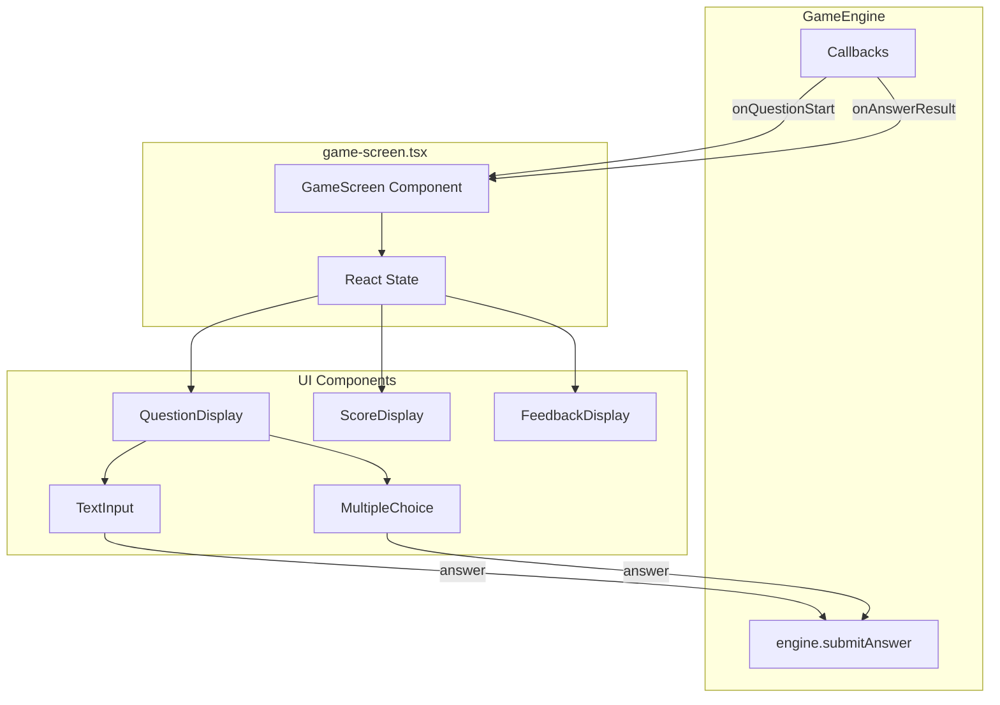

# Game UI Components (Task 2.6)

## Overview

Create the interactive UI layer for gameplay that connects to the existing `GameEngine` via callbacks. The UI will display questions, accept user input, show real-time score/streak, and provide feedback.

## Architecture




## Dependencies

**Add `ink-text-input**` for text input handling:

```bash
bun add ink-text-input
```

This is the standard Ink package for text input and is well-maintained.

## File Structure

```
src/ui/
├── components/
│   ├── question.tsx       # Question display + input handling
│   ├── score-display.tsx  # Score, streak, progress
│   └── index.ts           # Export new components
└── screens/
    ├── game-screen.tsx    # Main orchestration screen
    └── index.ts           # Export new screen
```

## Implementation Details

### 1. Score Display Component ([src/ui/components/score-display.tsx](src/ui/components/score-display.tsx))

Displays commits earned, current streak, and question progress.

**Props:**

```typescript
interface ScoreDisplayProps {
  totalCommits: number;
  currentStreak: number;
  currentQuestion: number;
  totalQuestions: number;
  gameId: string;
}
```

**Visual layout:**

```
┌─ file-detective ─────────────────────────────────────────┐
│  ★ 45 commits    🔥 3 streak    Progress: 2/5 ██░░░     │
└──────────────────────────────────────────────────────────┘
```

Uses existing `ProgressBar` component for progress, theme colors for commits (gold) and streak (primary).

---

### 2. Question Display Component ([src/ui/components/question.tsx](src/ui/components/question.tsx))

Handles both question display and answer input based on question type.

**Props:**

```typescript
interface QuestionDisplayProps {
  question: GameQuestion;
  onSubmit: (answer: string) => void;
  disabled?: boolean;
}
```

**Question type handling:**

- **multiple-choice**: Render numbered options, use `useInput` hook to detect 1-4 keys
- **text-input**: Use `ink-text-input` for free-form text entry
- **marker/timed**: Same as above with appropriate UI hints

**Visual layout (multiple-choice):**

```
╭──────────────────────────────────────────────────────────╮
│  What function handles user authentication?              │
│                                                          │
│  Context: src/auth/login.ts                              │
╰──────────────────────────────────────────────────────────╯

  [1] handleLogin()
  [2] authenticateUser()
  [3] validateCredentials()
  [4] processAuth()

  Press 1-4 to select, or H for hint
```

**Visual layout (text-input):**

```
╭──────────────────────────────────────────────────────────╮
│  What is the name of the main configuration file?        │
╰──────────────────────────────────────────────────────────╯

  > config.json█

  Press Enter to submit, or H for hint
```

---

### 3. Feedback Display (inline in question.tsx)

Show result after answer submission:

```
✓ CORRECT                                         +10 commits
  Great! authenticateUser() handles the OAuth flow.
```

```
✗ BUILD FAILED                                     +0 commits
  The correct answer was handleLogin(). It's defined at line 42.
```

---

### 4. Game Screen ([src/ui/screens/game-screen.tsx](src/ui/screens/game-screen.tsx))

Main orchestration component that manages game state and engine interaction.

**Props:**

```typescript
interface GameScreenProps {
  engine: GameEngine;
}
```

**State management:**

- `currentQuestion: GameQuestion | null`
- `lastResult: AnswerResult | null`
- `showingFeedback: boolean`
- `progress: EngineProgress`

**Lifecycle:**

1. Mount → call `engine.startSession()` or `engine.resumeSession()`
2. Engine callback `onQuestionStart` → update `currentQuestion`
3. User submits answer → call `engine.submitAnswer()`
4. Engine callback `onAnswerResult` → show feedback, then advance
5. Engine callback `onGameComplete` → show game transition
6. Engine callback `onSessionComplete` → render completion (can reuse existing screens)

**Screen layout:**

```
╔═══════════════════════════════════════════════════════════════════╗
║  OnboardMe                                                        ║
╠═══════════════════════════════════════════════════════════════════╣
║                                                                   ║
║  ┌─ file-detective ────────────────────────────────────────────┐  ║
║  │  ★ 45 commits    🔥 3 streak    Progress: 2/5 ██░░░        │  ║
║  └─────────────────────────────────────────────────────────────┘  ║
║                                                                   ║
║  ╭─────────────────────────────────────────────────────────────╮  ║
║  │  [Question prompt here]                                     │  ║
║  │                                                             │  ║
║  │  Context: [optional context]                                │  ║
║  ╰─────────────────────────────────────────────────────────────╯  ║
║                                                                   ║
║    [1] Option A                                                   ║
║    [2] Option B                                                   ║
║    [3] Option C                                                   ║
║    [4] Option D                                                   ║
║                                                                   ║
║  Press 1-4 to select                                              ║
║                                                                   ║
╚═══════════════════════════════════════════════════════════════════╝
```

---

## Key Implementation Notes

1. **Use `useInput` from Ink** for keyboard handling (multiple-choice selection, hint trigger)
2. **Use `ink-text-input**` for text-input question types
3. **Delay auto-advance** after feedback (1-2 seconds) to let user read result
4. **Hint display**: Track hints used, show hint when H pressed, increment `hintsUsed` in engine
5. **Timer display**: For `timed` questions, show countdown using theme colors (green → gold → red)

## Export Updates

Add new components to [src/ui/components/index.ts](src/ui/components/index.ts):

```typescript
export { ScoreDisplay } from "./score-display.tsx";
export { QuestionDisplay } from "./question.tsx";
```

Add new screen to [src/ui/screens/index.ts](src/ui/screens/index.ts):

```typescript
export { GameScreen } from "./game-screen.tsx";
```

