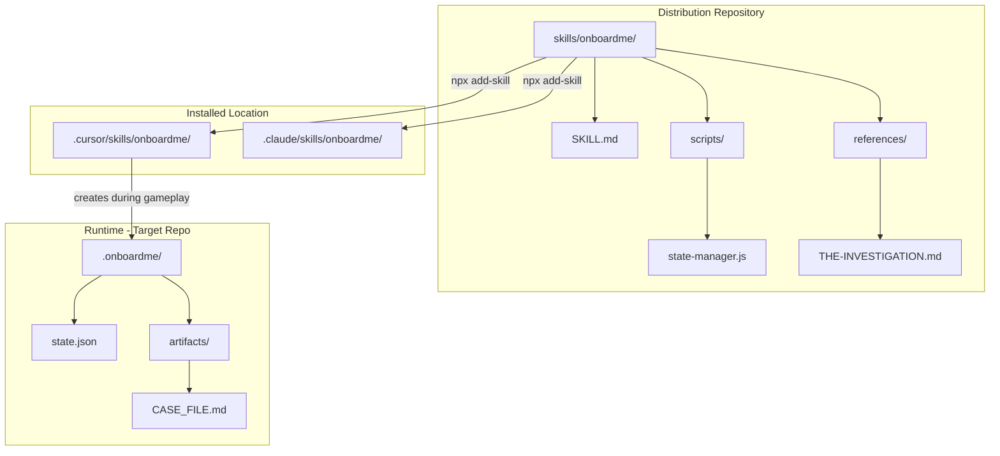

# Milestone 1: Orchestrator MVP Implementation

## Overview

Build OnboardMe as an Agent Skill following the open standard. The skill can be installed via `npx add-skill` and works across Cursor, Claude Code, Codex, and other compatible agents. All scripts are JavaScript (no TypeScript) to avoid compilation.

## Architecture



## File Structure

**Distribution (this repo):**

```
skills/
└── onboardme/
    ├── SKILL.md                    # Main skill file (YAML frontmatter + instructions)
    ├── scripts/
    │   └── state-manager.js        # State read/write/migrate utilities
    └── references/
        └── THE-INVESTIGATION.md    # Chapter 1 investigation flow
```

**Installed to user's project:**

```
.cursor/skills/onboardme/           # or .claude/skills/onboardme/
├── SKILL.md
├── scripts/
│   └── state-manager.js
└── references/
    └── THE-INVESTIGATION.md
```

**Created during gameplay (in target repo):**

```
.onboardme/
├── state.json                      # Game progress
├── state.backup.json               # Auto-backup
└── artifacts/
    └── CASE_FILE.md               # Investigation artifact
```

---

## Task 1.1: Create Skill Structure

**File:** [skills/onboardme/SKILL.md](skills/onboardme/SKILL.md)

YAML frontmatter format per Agent Skills standard:

```yaml
---
name: onboardme
description: >
  Gamified codebase onboarding through the Spaghetti Code Monster. 
  Use when a developer wants to learn a new codebase through 
  investigation, hands-on challenges, and the Monster's guidance.
license: MIT
metadata:
  author: onboardme
  version: "1.0.0"
---
```

**Skill content sections:**

- Overview and personality (Monster character)
- Available commands and when to use each
- State management instructions (reference scripts/state-manager.js)
- Chapter routing logic
- Persona lock instructions (never break character)

---

## Task 1.2: State Manager Script

**File:** [skills/onboardme/scripts/state-manager.js](skills/onboardme/scripts/state-manager.js)

Plain JavaScript utility that agents can execute:

```javascript
const fs = require("fs");
const path = require("path");

const STATE_PATH = ".onboardme/state.json";
const BACKUP_PATH = ".onboardme/state.backup.json";
const SCHEMA_VERSION = 1;

function getDefaultState() {
  return {
    schemaVersion: SCHEMA_VERSION,
    repo: { id: "", path: "", name: "" },
    player: { name: "", totalCommits: 0, currentLives: 5, startedAt: "" },
    progress: {
      currentChapter: "investigation",
      currentGame: "",
      chaptersCompleted: [],
      questionHistory: [],
    },
    monster: {
      currentMood: "dismissive",
      respectLevel: 0,
      memorableExchanges: [],
      lastMockery: "",
    },
    session: {
      conversationSummary: "",
      lastEmotionalBeat: "",
      pendingCallbacks: [],
    },
    behavior: {
      hintUsageCount: 0,
      averageResponseTime: 0,
      accuracyByTopic: {},
      playerStyle: "balanced",
    },
    context: { prepared: false, preparedAt: "", contextFiles: [] },
    preferences: { monsterTone: "balanced" },
  };
}

function readState() {
  /* ... */
}
function writeState(state) {
  /* ... */
}
function migrateState(state) {
  /* ... */
}
function initializeState(repoInfo) {
  /* ... */
}
function updateState(updates) {
  /* ... */
}

module.exports = {
  readState,
  writeState,
  migrateState,
  initializeState,
  updateState,
};
```

**Key behaviors:**

- Creates `.onboardme/` directory if missing
- Backs up state before every write
- Returns default state if file missing/corrupted
- Deep merges updates (preserves unmodified fields)

---

## Task 1.3: Commands in SKILL.md

The SKILL.md file contains instructions for these commands:

### Prepare Game

Agent behavior when user says "prepare game" or similar:

1. Scan repository root for project files
2. Identify: package.json, go.mod, Cargo.toml, README.md, etc.
3. Create `.onboardme/` directory
4. Run `initializeState()` with repo info
5. Report findings in Monster voice

### Play Game

Agent behavior when user says "play game" or invokes `/onboardme`:

1. Check if `context.prepared === true`
2. If not: prompt to prepare first
3. Load state, check `progress.currentChapter`
4. Read appropriate chapter reference file
5. Activate Monster persona
6. Begin/resume gameplay

### Status

Agent shows progress when user asks for status:

```
*kzzzt*

== CASE STATUS ==

Chapter: Investigation (1/5)
Score: 4 commits earned
Lives: 5/5

Monster Mood: dismissive
"You haven't impressed me yet."

Next: Continue the investigation
```

### Hint

Progressive hint system (costs 1 commit per hint):

1. First: Vague direction
2. Second: More specific
3. Third: Nearly explicit
4. Fourth: Full answer (no cost, but Monster disappointed)

### Reset

Clear state and start over (with confirmation).

---

## Task 1.4: Chapter 1 Reference File

**File:** [skills/onboardme/references/THE-INVESTIGATION.md](skills/onboardme/references/THE-INVESTIGATION.md)

Contains the full investigation flow per [context/chapters/01-THE-INVESTIGATION.md](context/chapters/01-THE-INVESTIGATION.md):

**Sections:**

- Phase 1: Project Identity (~5 min)
- Phase 2: Tech Stack Discovery (~7 min)
- Phase 3: Documentation Hunt (~5 min)
- Phase 4: Final Deduction (~3 min)

**Rubric:**

| Tier      | Criteria                         | Reward             |
| --------- | -------------------------------- | ------------------ |
| Incorrect | Wrong tech/type                  | 0 commits, -1 life |
| Partial   | Right direction, missing details | 1 commit           |
| Correct   | Accurate identification          | 2 commits          |
| Deep      | Shows architectural insight      | 3 commits          |

**CASE_FILE.md artifact:**

- Created at start of investigation
- Updated after each finding
- Final summary with Monster's verdict

**Monster dialogue examples:**

- Opening, evaluation responses, transitions, completion

---

## Task 1.5: Integration Test

### Installation Test

```bash
# From onboardme repo root
npx add-skill . --skill onboardme

# Verify installation
ls -la .cursor/skills/onboardme/
```

### Gameplay Test

1. Open Cursor in a test project
2. Type `/onboardme` or ask to "start onboarding"
3. Verify Monster introduces itself
4. Run through prepare -> play -> status flow
5. Check `.onboardme/state.json` persists correctly
6. Exit and resume to verify continuity

### Cross-Platform Test

Test installation paths:

- Cursor: `.cursor/skills/onboardme/`
- Claude Code: `.claude/skills/onboardme/`

---

## Installation

Users install via:

```bash
# From GitHub (once published)
npx add-skill your-username/onboardme

# Or specific skill
npx add-skill your-username/onboardme --skill onboardme
```

The skill is then available via `/onboardme` or automatically when the agent detects onboarding-related tasks.

---

## Technical Notes

### JavaScript over TypeScript

- `state-manager.js` runs directly with Node.js or Bun
- No build step required
- Agent reads and executes scripts directly

### Agent Execution Model

- Agent reads SKILL.md to understand behavior
- Agent reads reference files for chapter-specific instructions
- Agent executes scripts/state-manager.js for state operations
- Agent creates/updates files in `.onboardme/` during gameplay

### State Separation

- Skill files: Read-only, installed to `.cursor/skills/`
- Game state: Read-write, created in `.onboardme/` in target repo
- Artifacts: Created during gameplay in `.onboardme/artifacts/`
