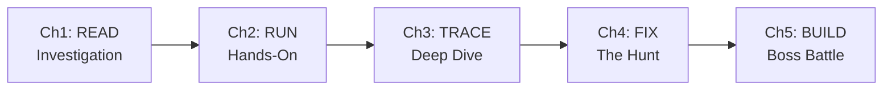
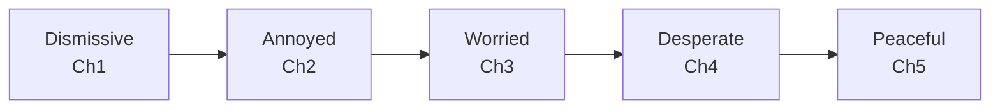
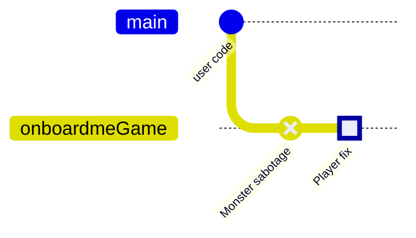

# Milestone 3: Act 2 — From Understanding to Action

## The Big Picture

Milestone 3 delivers the emotional and gameplay heart of OnboardMe. Chapters 3-4 are where the game shifts from **passive investigation** to **active modification** — and where the Monster's armor starts to crack.

---

## Gameplay Alignment Analysis

### The Skill Progression Chain

Each chapter adds a new dimension of player agency:



- **Ch1** (done): Player observes, Monster quizzes -- pure knowledge extraction
- **Ch2** (reference exists): Player executes commands -- first real interaction with running code
- **Ch3** (this milestone): Player traces paths through code -- first time connecting pieces into systems
- **Ch4** (this milestone): Player changes actual code -- first time the codebase is modified
- **Ch5** (reference exists): Player creates new code -- proves they can extend the system

Ch3 is the **bridge** -- it teaches the player to think in layers (Route -> Controller -> Service -> Repository -> Database) which is the exact skill needed to trace bugs backward in Ch4.

### The Monster's Emotional Arc



Act 2 (Chapters 3-4) is where the Monster's character deepens:

- **Ch3 (worried)**: The player traces flows -- they're not just surface-level anymore. Monster's backstory surfaces: "I was beautiful once. Single-responsibility." The Monster starts revealing vulnerability because the player is proving they can understand the WHY, not just the WHAT.
- **Ch4 (desperate)**: The player FIXES things. This is the Monster's existential crisis -- if someone can fix bugs, they might eventually make the Monster obsolete. The emotional peak: "That bug was MINE. Part of my architecture. You're not just reading anymore. You're CHANGING things."

### What Each Chapter Validates

| Chapter        | Player Proves                        | Monster's Fear         |
| -------------- | ------------------------------------ | ---------------------- |
| Ch3: Deep Dive | "I understand how this system works" | "They see my patterns" |
| Ch4: The Hunt  | "I can find problems and fix them"   | "They can CHANGE me"   |

---

## Chapter 3: The Deep Dive — Design Decisions

### Core Mechanic: Collaborative Diagram Building

Unlike Ch1 (quiz) or Ch4 (fix), Ch3 is **collaborative**. The Monster and player build FLOW_MAP.md together. The Monster traces alongside the player -- reading files, confirming steps, adding Mermaid diagrams as the player gets each layer right.

This creates a unique dynamic: the Monster is reluctantly cooperating, pointing at code ("I see an existing export.service.ts") while the player traces the path. It's the first time the Monster acts as a guide rather than just an evaluator.

### Three Phases

1. **Flow Trace (~10 min)**: Trace a user action from entry point to data layer

- The agent picks a realistic user journey from the actual codebase
- Player follows the code path layer by layer
- Each correct step adds to FLOW_MAP.md with a Mermaid diagram
- Rubric: missing a layer = partial, complete trace = correct, alternate paths/edge cases = deep

1. **Entity Relations (~8 min)**: Discover how main entities connect

- Agent identifies key models/types from the codebase
- Player investigates relationships (one-to-many, composition, etc.)
- Builds an ER diagram in FLOW_MAP.md
- This teaches the player about the data model they'll need for Ch4

1. **Test Stories (~7 min)**: Learn expected behaviors from test files

- Agent explores test files and asks "what rules does this codebase promise?"
- Player reads test assertions to extract business rules
- Directly prepares them for Ch4 where they'll run and use tests

### Monster Voice in Ch3

The worried Monster leaks backstory. Key emotional beats:

- "I was beautiful once. Clean. Single-responsibility." (origin story fragment)
- "You think in layers now. Entry -> Handler -> Service -> Data. That's how the code thinks too." (grudging respect)
- "The thing about trails... is they go BOTH ways. You can trace features forward. But can you trace bugs BACKWARD?" (chapter transition tease)

### Reference File: `THE-DEEP-DIVE.md`

Follow the established reference pattern from [THE-INVESTIGATION.md](skills/onboardme/references/THE-INVESTIGATION.md):

- CRITICAL sections (Monster Voice, Build on Prior Chapters)
- Resources / State Management / Scoring Rubric
- 3 Phases with dialogue examples
- Recovery patterns
- Monster mood notes (annoyed -> worried, make it visible)

---

## Chapter 4: The Hunt — Design Decisions

### Core Mechanic: The Monster Sabotages the Codebase

The Monster has been losing ground since Chapter 1. In Chapter 4, **it fights back**. The Monster deliberately breaks the code — introducing subtle bugs via commits on a game branch. The player must diagnose what happened, understand why it breaks, and fix it.

This is narratively, educationally, and mechanically superior to "find existing bugs":

- **Narrative**: The Monster is desperate. It does the one thing it can — sabotage its own codebase. "You think you understand me? Let's see what happens when I CHANGE something."
- **Educational**: Mirrors real debugging — "someone introduced a regression, figure out what happened." Tests the full workflow: read failure, form hypothesis, trace code, verify, fix.
- **Mechanical**: Works on ANY codebase. The agent controls difficulty. No dependency on pre-existing issues.

### The Game Branch (Already Set Up)

The game branch (`onboardme/game`) was created during prepare-game. The player has been on it since Chapter 1. Chapters 1-3 only read files -- nothing was modified. Now in Chapter 4, the Monster makes its first modifications on this branch.



The original branch is untouched. `.onboardme/` is gitignored so state persists regardless of branch. After the full game ends (Ch5), the player can merge their contribution to the original branch if they want, or simply switch back.

### Sabotage Design

The agent picks what to break based on:

- **Player's performance** — stronger players get subtler bugs
- **Codebase architecture** — sabotage targets areas the player traced in Ch3 (callback)
- **Available tests** — prefer changes that cause clear test failures

**Good sabotage types (plausible changes that subtly break behavior):**

- Change a comparison operator (`<=` to `<`) — boundary bug
- Remove a validation step — edge case regression
- Swap similar function calls — wrong behavior, right type signature
- Change a default value — works for most cases, fails for edge cases
- Remove an `await` — race condition / timing bug
- Modify a config value — cascading downstream effects

**Bad sabotage (too easy / too hard):**

- Deleting a function entirely (too obvious)
- Syntax errors (too obvious)
- Changing a variable name (caught by linter, not tests)
- Breaking 10 things at once (overwhelming)

**Commit messages should be misleading but plausible:**

- "refactor: simplify validation logic" (actually removed important validation)
- "perf: optimize database query" (actually changed query semantics)
- "cleanup: remove redundant check" (actually removed necessary check)

### Can the Player "Cheat" with Git?

The player could run `git log` or `git diff main` to find the changes. **This is fine** — in real debugging, checking recent commits IS a valid technique. The scoring rewards UNDERSTANDING, not just FINDING:

- **Partial**: Found the changed line but can't explain why it breaks
- **Correct**: Identified the change, explained the root cause, fixed it
- **Deep**: Explained the root cause, the downstream impact, AND how to prevent similar issues

The Monster doesn't mention git. It just says "something is broken." How the player debugs is up to them.

### No-Tests Scenario

If the codebase has no test runner or tests:

1. Monster introduces a bug that breaks **project startup** or **compilation**
2. OR Monster writes a simple test alongside the sabotage: "There are no tests? That IS the bug. Fine, I wrote one. Now tell me why it fails."
3. The "fix" includes both fixing the code AND understanding why tests matter

This turns the no-tests case into an additional learning moment.

### Four Phases

**Phase 1: The Sabotage (~3 min)**

Agent uses its accumulated knowledge from Ch1-3 discoveries to pick a sabotage target. It reads source files on-demand to find a good spot, makes the change, and commits it on the game branch. Then dramatically reveals what happened:

```
*MASSIVE STATIC SURGE*

"You traced the flows."

*tangle*

"You know how data SHOULD move."

*pause*

"But what happens when I... make a change?"

*crackle crackle crackle*

"I've done something."

*slrrrrp*

"Something is broken now."

*heh*

"The tests will tell you WHAT."

*pause*

"But YOU need to figure out WHY."

*[THE HUNT BEGINS]*
```

Agent runs tests and shows the failure output.

**Phase 2: The Hunt (~15 min)**

The player diagnoses, traces, and fixes the sabotage.

- Player reads test failure, forms hypothesis
- Player traces code to root cause (using skills from Ch3)
- Player EXPLAINS to the Monster what's wrong (Monster evaluates understanding)
- Player fixes the code
- Agent re-runs tests to validate
- Agent reviews git diff of the fix
- Optional: if player handles quickly, Monster reveals a second sabotage

**Phase 3: Feature Location (~10 min)**

Breathing room after the intensity of debugging. Different skill: architectural planning.

- Agent presents a realistic feature request for this codebase
- Player identifies where new code should live (files, layers, patterns)
- Tests architectural understanding from Ch3
- "You fixed my mess. Now show me where NEW code goes."

**Phase 4: Impact Reflection (~2 min)**

Quick systems thinking test:

- "If I removed [key service], what would break?"
- Player traces dependencies and downstream effects
- Validates that the player sees the whole system, not just individual files

### Monster Voice in Ch4

The desperate Monster. Key emotional beats:

- "What happens when I make a change?" (the sabotage reveal — dramatic, aggressive)
- "That bug was MINE. Part of my architecture." (existential crisis when player finds it)
- "You actually fixed it. Most people just comment out the test." (grudging respect)
- "You're not just reading anymore. You're CHANGING things." (fear)
- "You're thinking like someone who BELONGS here." (Monster's worst nightmare)
- "Come understand ME." (transition to Ch5 — resigned, almost inviting defeat)

### Reference File: `THE-HUNT.md`

Same structure as other references. Key unique sections:

- **Sabotage selection guidelines** — how to pick what to break using accumulated discoveries from Ch1-3, reading source files on-demand
- **Sabotage execution** — make the change, commit with misleading message on the game branch
- **Test execution and validation workflow** — running tests, showing output, re-running after fix
- **No-tests fallback** — what to do when there's no test infrastructure
- **IMPACT_ANALYSIS.md artifact template**

---

## Technical Changes

### 1. Game Branch in Prepare

Update [prepare-game.md](skills/onboardme/instructions/prepare-game.md) to add a new step after repo analysis:

- Check if git is available (Chapter 4 depends on it)
- Explain to the player: "Gameplay happens on a safe branch. Your original code is never touched."
- If uncommitted changes exist, let the PLAYER decide: commit, stash, or revert (don't force a choice)
- Create `onboardme/game` branch from current HEAD and switch to it
- Record original branch name in state (for cleanup after the game)

This is the ONLY new prepare-game change. The existing knowledge schema already gathers `techStack.testing` and `commands.test` -- no new sections needed. Sabotage target selection is a runtime concern for Ch4 (the agent uses accumulated `discoveries[]` from Ch1-3 to pick targets).

### 2. Chapter Transition in Existing References

[THE-HANDS-ON.md](skills/onboardme/references/THE-HANDS-ON.md) already transitions to `deep-dive`. Verify the closing dialogue creates the right emotional bridge: "You can run it. But running code is not the same as understanding code."

### 3. State Manager Updates

Check if `state-manager.cjs` needs updates for:

- Tracking the game branch name and original branch (for post-game cleanup)
- Bug hunt results in questionHistory (what was sabotaged, how player fixed it)

### 4. Safety Rules Update

Add explicit language to [SAFETY-RULES.md](context/agent/SAFETY-RULES.md) about the game branch:

- Prepare-game creates `onboardme/game` branch as a sanctioned game mechanic
- Original branch is never modified
- All gameplay (including Ch4 sabotage and Ch5 contribution) happens on this branch
- Player can abort at any time -- agent switches back to original branch

---

## Language and Vibe Guidelines

### Principles for New Chapters

1. **Never repeat what prior chapters tested** -- Ch3 must NOT re-ask "What type of project is this?" Ch4 must NOT re-ask "How do you run it?"
2. **Reference prior knowledge naturally** -- "You said this was Express with PostgreSQL. Now trace what happens when a user creates a project."
3. **Build on callbacks** -- Save memorable moments from Ch1-2, reference them in Ch3-4. "Remember when you found the auth flow? Apply that here."
4. **Escalate the stakes** -- Ch3 questions go deeper than Ch1. Ch4 requires actual changes. Each chapter should feel harder but the player is more capable.
5. **The Monster is the codebase** -- In Ch3 the Monster reveals its architecture reluctantly. In Ch4 it panics because the player is modifying it.

### Voice Evolution Across Act 2

- **Ch3 Monster**: Reluctant collaborator. Still snarky but occasionally drops guard. Uses more `*whirrrr*` (processing, concern) and `*tangle*` (painful memories). Leaks backstory.
- **Ch4 Monster**: Existential crisis mode. More `*TANGLE TANGLE TANGLE*` (uppercase = intensity). `*static spike*` when the player makes a change. Dramatic pauses lengthen. CAPS appear in dialogue ("You're CHANGING things").

---

## Playtest Strategy

Playtest Chapters 3 and 4 sequentially on a real codebase with tests:

**Chapter 3 validation:**

1. Does Ch3 opening land? (transition from "you can run it" to "do you know how it WORKS?")
2. Does collaborative diagram building feel natural?
3. Does the Monster's backstory reveal feel earned?
4. Does FLOW_MAP.md build progressively and feel useful?

**Chapter 4 validation:**

1. Does the sabotage target make sense given Ch3 discoveries? (callback to what player traced)
2. Does the sabotage feel believable? (not too obvious, not too subtle)
3. Does the test failure output give enough signal to start investigating?
4. Does the Monster evaluate UNDERSTANDING, not just "did they find the line"?
5. Does fix validation work? (tests pass after fix, diff looks clean)
6. Does the Monster's desperation feel authentic?

**Transition validation:**

1. Does the Ch3 -> Ch4 transition create anticipation? ("trace bugs BACKWARD")
2. Does Act 2 ending ("Come understand ME") set up Ch5?
3. Does the emotional arc from worried to desperate feel earned?

**Edge case to test separately:**

1. Try on a codebase with NO tests — does the fallback strategy work?
