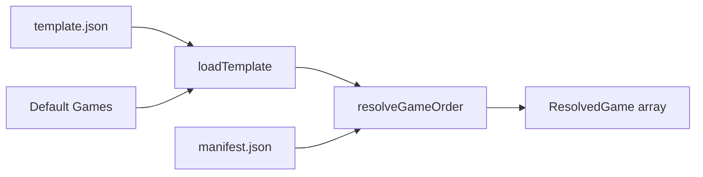

# Template Loader Implementation

## Goal

Load game templates from `.onboardme/template/` and resolve the final game order by cross-referencing with the manifest.

## Key Files

- **Create:** [src/core/template.ts](src/core/template.ts) - Template loading and resolution
- **Create:** [src/types/template.ts](src/types/template.ts) - Template type definitions
- **Update:** [src/core/index.ts](src/core/index.ts) - Export new functions
- **Create:** [tests/unit/template.test.ts](tests/unit/template.test.ts) - Unit tests

## Design

### Data Flow




### Types ([src/types/template.ts](src/types/template.ts))

```typescript
interface TemplateGame {
  id: string;
  options?: Record<string, unknown>;
}

interface Template {
  games: TemplateGame[];
}

interface ResolvedGame {
  id: string;
  position: number;
  name: string;
  description: string;
  estimatedMinutes: number;
  isBoss: boolean;
  ready: boolean;
}

interface TemplateLoadResult {
  template: Template;
  source: "user" | "default";
}

interface GameResolutionResult {
  success: boolean;
  games: ResolvedGame[];
  errors: string[];
}
```

### Functions ([src/core/template.ts](src/core/template.ts))

1. **loadTemplate(rootDir: string): PromiseTemplateLoadResult**
  - Check for `.onboardme/template/template.json`
  - If exists, parse and validate with Zod
  - If not, return default template (hardcoded list: file-detective, flow-trace, grep-hunt, spaghetti-monster)
2. **resolveGameOrder(template: Template, manifest: Manifest): GameResolutionResult**
  - For each game in template, find matching entry in manifest
  - Return errors if template game not found in manifest
  - Return resolved games with full metadata from manifest
  - Boss game (spaghetti-monster) always goes last
3. **getDefaultTemplate(): Template**
  - Returns the default game order

## Validation Rules

- Template must have at least 1 game
- Each game in template must exist in manifest
- Each game in manifest must be `ready: true`
- `spaghetti-monster` (if present) must be last in order

## Integration Points

- Reuse `fileExists()`, `readJson()` from [src/lib/fs.ts](src/lib/fs.ts)
- Reuse `getTemplateDir()` from [src/lib/paths.ts](src/lib/paths.ts)
- Use Zod for template validation (consistent with [src/services/validation.ts](src/services/validation.ts))
- Export from [src/core/index.ts](src/core/index.ts)

## Test Cases

1. Load user template from file
2. Fall back to default template when no user template
3. Resolve game order successfully
4. Error when template game missing from manifest
5. Error when template game not ready in manifest
6. Boss game always positioned last

