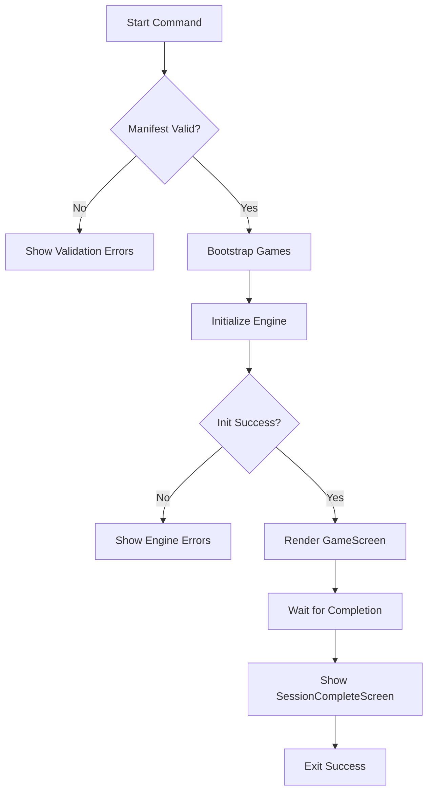

# Wire Up Start Command

## Current State

The start command (`[src/commands/start.tsx](src/commands/start.tsx)`) currently:

- Validates the manifest exists and is well-formed
- Shows a success screen listing available games
- Does **not** actually launch any games

All supporting pieces are ready:

- `GameEngine` in `[src/core/engine.ts](src/core/engine.ts)` - orchestrates game flow
- `GameScreen` and `SessionCompleteScreen` in `[src/ui/screens/game-screen.tsx](src/ui/screens/game-screen.tsx)` - UI components
- `MockGame` in `[src/games/mock/index.ts](src/games/mock/index.ts)` - test game plugin
- Game registry in `[src/core/registry.ts](src/core/registry.ts)` - plugin registration

## Implementation

### 1. Add Interactive Render Function

Update `[src/ui/render.tsx](src/ui/render.tsx)` to support interactive screens that wait for completion:

```typescript
export function renderInteractiveScreen<T>(
  createComponent: (resolve: (value: T) => void) => React.ReactElement
): Promise<T> {
  return new Promise((resolve) => {
    const { unmount, waitUntilExit } = render(
      <ThemeProvider>{createComponent(resolve)}</ThemeProvider>
    );
    waitUntilExit().then(() => unmount());
  });
}
```

### 2. Create Game Bootstrap Module

Create `[src/core/bootstrap.ts](src/core/bootstrap.ts)` to register available game plugins:

```typescript
import { registerGame } from "./registry.ts";
import { MockGame } from "@/games/mock/index.ts";

export function bootstrapGames(): void {
  registerGame("mock-game", MockGame);
}
```

This centralizes game registration and will scale when more games are added.

### 3. Update Start Command

Rewrite `[src/commands/start.tsx](src/commands/start.tsx)` to:

1. Validate manifest (existing)
2. Bootstrap game plugins
3. Create and initialize `GameEngine`
4. Handle engine initialization errors (missing plugins, missing prepared data)
5. Render `GameScreen` interactively
6. On completion, show `SessionCompleteScreen`

High-level flow:




### 4. Add Engine Error Screen

Add a new screen component for engine initialization errors in `[src/ui/screens/start-screen.tsx](src/ui/screens/start-screen.tsx)`:

```typescript
interface EngineInitErrorScreenProps {
  errors: string[];
}

export function EngineInitErrorScreen({ errors }: EngineInitErrorScreenProps): React.ReactElement
```

## File Changes Summary


| File                                      | Change                                 |
| ----------------------------------------- | -------------------------------------- |
| `src/ui/render.tsx`                       | Add `renderInteractiveScreen` function |
| `src/core/bootstrap.ts`                   | Create - register game plugins         |
| `src/commands/start.tsx`                  | Rewrite to launch engine and game UI   |
| `src/ui/screens/start-screen.tsx`         | Add `EngineInitErrorScreen`            |
| `src/ui/screens/index.ts`                 | Export new screen                      |
| `tests/integration/start-command.test.ts` | Create - CLI integration tests         |


## Testing Strategy

### 5. CLI Integration Tests

Create `[tests/integration/start-command.test.ts](tests/integration/start-command.test.ts)` with tests for:

**Error scenarios (exit codes):**

- Returns `ExitCode.ValidationFailed` when manifest is missing
- Returns `ExitCode.ValidationFailed` when manifest is malformed
- Returns `ExitCode.GeneralError` when engine initialization fails (missing plugin)

**Happy path scenarios:**

- Successfully initializes engine with valid prepared data
- Plays through mock game questions and completes
- Returns `ExitCode.Success` on successful completion
- Session stats are captured correctly (commits, correct answers)

**Test approach:**

Since the start command is interactive (user answers questions), we'll use two strategies:

1. **Error cases**: Spawn CLI subprocess (like init tests), verify exit codes
2. **Happy path**: Test the command logic directly by:
  - Creating test fixtures with mock game data
  - Mocking `renderInteractiveScreen` to simulate game completion
  - Verifying the engine initializes and state is updated correctly

```typescript
describe("startCommand", () => {
  describe("error handling", () => {
    it("returns ValidationFailed when manifest is missing", async () => {
      const proc = Bun.spawn(["bun", "run", CLI_PATH, "start"], {
        cwd: emptyTestDir,
      });
      const exitCode = await proc.exited;
      expect(exitCode).toBe(ExitCode.ValidationFailed);
    });
  });

  describe("happy path", () => {
    it("initializes engine and plays through mock game", async () => {
      // Create fixtures with mock-game
      // Mock renderInteractiveScreen to auto-complete
      // Verify engine.initialize() succeeds
      // Verify session completes with correct stats
    });

    it("returns Success after completing all games", async () => {
      // Full flow test with mocked rendering
    });
  });
});
```

**Why this approach:**

- Subprocess tests verify real CLI behavior for error cases
- Direct function tests allow us to control the interactive flow for happy paths
- Reuses existing test fixtures system from `src/testing/`

### Manual Testing

After implementation, also verify manually:

1. `onboardme start` without prepared data - shows validation errors
2. `onboardme start` with mock game prepared data - plays through questions
3. Session completion shows stats correctly

---

## Implementation Complete

**Status**: ✓ Completed

**Files Created/Modified**:
| File | Change |
|------|--------|
| `src/ui/render.tsx` | Added `renderInteractiveScreen` function |
| `src/core/bootstrap.ts` | Created - registers game plugins |
| `src/commands/start.tsx` | Rewritten to launch engine and game UI |
| `src/ui/screens/start-screen.tsx` | Added `EngineInitErrorScreen` |
| `src/ui/screens/index.ts` | Exported new screen |
| `tests/integration/start-command.test.ts` | Created - 5 CLI integration tests |

**Test Results**: 5 tests passing
- NotInitialized when .onboardme missing
- ValidationFailed when manifest missing
- ValidationFailed when manifest malformed
- GeneralError when plugin not registered
- GeneralError when prepared data missing

